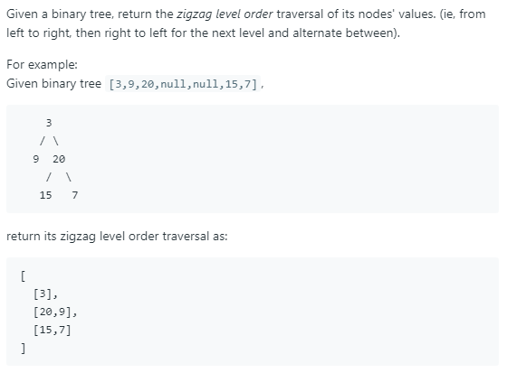

### Question



### My solution
Level order traversal with a small modification.
```python
# Definition for a binary tree node.
# class TreeNode(object):
#     def __init__(self, x):
#         self.val = x
#         self.left = None
#         self.right = None

class Solution(object):
    def __init__(self):
        pass
    
    def zigzagLevelOrder(self, root):
        """
        :type root: TreeNode
        :rtype: List[List[int]]
        """
        # Idea:
        # 1. for each level, create a stack
        # 2. as we traverse (in level order), push nodes into the stack of the next level
        
        # edge cases
        if root is None:
            return []
        else:
            # for storing solution
            self.solution_ls = [[]]
            
            # essential variables to keep track of during traversal
            curr_stack = [root]
            next_stack = []
            go_left = False
            
            # process level by level
            while True:
                self.process_level(curr_stack, next_stack, go_left)
                
                if len(next_stack) == 0:
                    # reached the bottom of the tree
                    break
                else:
                    curr_stack = next_stack
                    next_stack = []
                    go_left = not go_left 
                    self.solution_ls.append([])
            
            return self.solution_ls
    
    def process_level(self, curr_stack, next_stack, go_left):
        N = len(curr_stack)
        
        while N > 0:
            node = curr_stack.pop()
            self.process_node(node, next_stack, go_left)
            N = len(curr_stack)
    
    def process_node(self, node, next_stack, go_left):
        self.solution_ls[-1].append(node.val)
        
        def append(child):
            if child is not None:
                next_stack.append(child)
        
        if go_left:
            append(node.right)
            append(node.left)
        
        else:
            append(node.left)
            append(node.right)
```