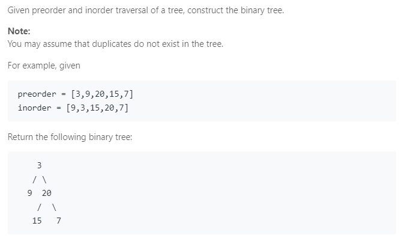

### Question



### My solution
```python
# Definition for a binary tree node.
# class TreeNode(object):
#     def __init__(self, x):
#         self.val = x
#         self.left = None
#         self.right = None

class Solution(object):
    def buildTree(self, preorder, inorder):
        """
        :type preorder: List[int]
        :type inorder: List[int]
        :rtype: TreeNode
        """
        if len(preorder) == 0:
            return None
        
    	elif len(preorder) == 1:
    		return TreeNode(preorder[0])

    	else:
	    	root_val = preorder[0]
	    	
	    	# search for position of root in inorder list
	    	i = 0
	    	for j, val in enumerate(inorder):
	    		if val == root_val:
	    			i = j
	    			break

	    	# create root node
	    	root = TreeNode(root_val)

	    	if i > 0:
	    		root.left = self.buildTree(preorder[1:1+i], inorder[0:i])
	    	if i < len(inorder) - 1:
	    		root.right = self.buildTree(preorder[i+1:], inorder[i+1:])

	    	return root
```