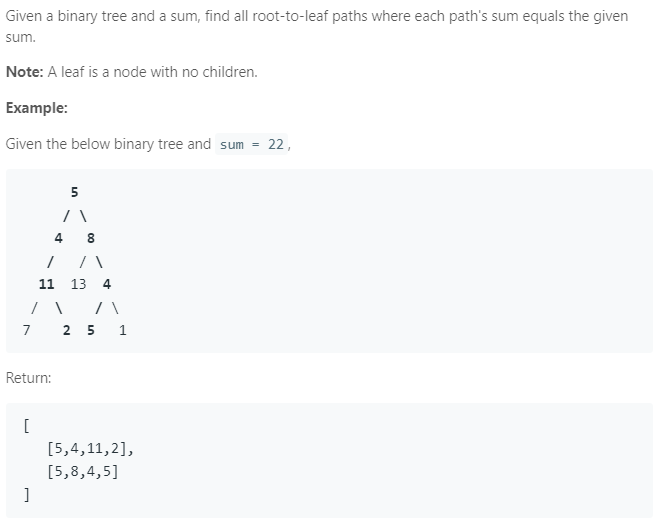

### Question



### My solution
```python
# Definition for a binary tree node.
# class TreeNode(object):
#     def __init__(self, x):
#         self.val = x
#         self.left = None
#         self.right = None

class Solution(object):
    def traverse(self, node, ls = [], sum = 0):
        if node == None:
            return
        else:
            ls.append(node.val)
            
            # traverse left
            if node.left:
                self.traverse(node.left, ls, sum + node.val)
            
            # traverse right
            if node.right:
                self.traverse(node.right, ls, sum + node.val)
            
            # if at tail, check if sum matches
            if (not node.right) and (not node.left):
                if sum + node.val == self.sum:
                    self.solution.append(list(ls))
                
            ls.pop()
    
    def pathSum(self, root, sum):
        """
        :type root: TreeNode
        :type sum: int
        :rtype: List[List[int]]
        """
        self.solution = []
        self.sum = sum
        
        self.traverse(root, [], 0)
        
        return self.solution
```