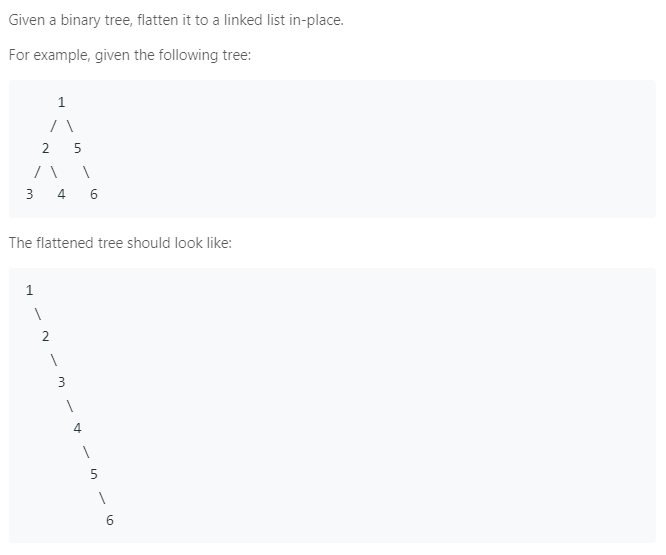

### Question



### My solution
```python
# Definition for a binary tree node.
# class TreeNode(object):
#     def __init__(self, x):
#         self.val = x
#         self.left = None
#         self.right = None

class Solution(object):
    def __init__(self):
        self.stack = []
    
    def flatten(self, root):
        """
        :type root: TreeNode
        :rtype: void Do not return anything, modify root in-place instead.
        """
        if root is None:
            return
        
        elif root.left and root.right:
            self.stack.append(root.right)
            root.right = root.left
            root.left = None
            self.flatten(root.right)

        elif root.left and (not root.right):
            root.right = root.left
            root.left = None
            self.flatten(root.right)

        elif root.right and (not root.left):
            self.flatten(root.right)

        elif len(self.stack) > 0:
            root.right = self.stack.pop()
            self.flatten(root.right)
```