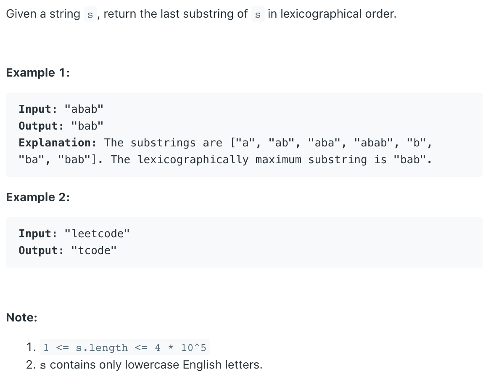

### Question



### My solution
```python
class Solution:
    def lastSubstring(self, s: str) -> str:
        largest_char, intervals = max(s), []
        for i, char in enumerate(s):
            if char == largest_char:
                if len(intervals) > 0 and intervals[-1][1] == i-1:
                    intervals[-1] = (intervals[-1][0], i, [])
                else:
                    intervals.append((i, i, []))
            elif len(intervals) > 0:
                intervals[-1][2].append(char)
        
        if len(intervals) == 1:
            return s[intervals[0][0]:]
        
        max_repeat = max(intervals, key=lambda i: i[1] - i[0])
        max_repeat = max_repeat[1] - max_repeat[0]
        intervals = [i for i in intervals if i[1] - i[0] == max_repeat]

        if len(intervals) <= 2 :
            return s[intervals[0][0]:] 
        
        best_interval = max(intervals, key=lambda i: ''.join(i[2]))
        return s[best_interval[0]:]

```
