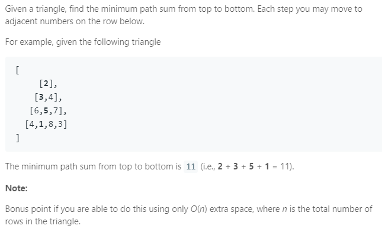

### Question



### My solution
```python
class Solution(object):
    def minimumTotal(self, triangle):
        """
        :type triangle: List[List[int]]
        :rtype: int
        """
        N = len(triangle)
        
        if N == 1:
            return triangle[0][0]
        
        table = [[0 for j in range(i+1)] for i in range(N)]
        table[0][0] = triangle[0][0]
        
        for i, row in enumerate(triangle):
            for j, cost in enumerate(row):
                if i == 0 and j == 0:
                    continue
                elif j == 0:
                    table[i][j] = triangle[i][j] + table[i-1][j]
                elif j == len(row) - 1:
                    table[i][j] = triangle[i][j] + table[i-1][j-1]
                else:
                    table[i][j] = triangle[i][j] + min(table[i-1][j-1], table[i-1][j])
                    
        return min(table[-1])
```