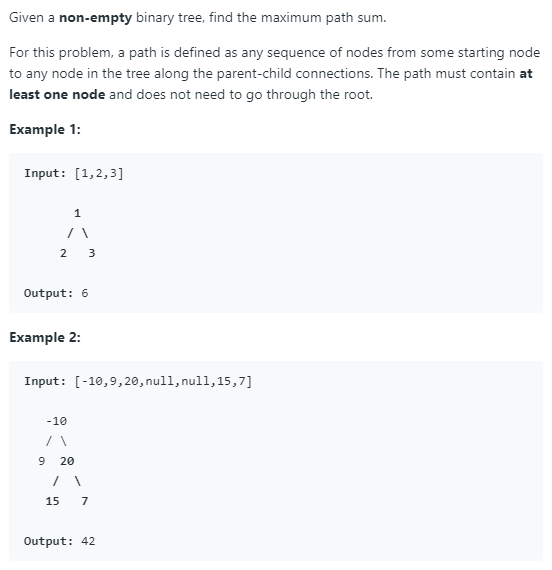

### Question



### My solution
```python
# Definition for a binary tree node.
# class TreeNode(object):
#     def __init__(self, x):
#         self.val = x
#         self.left = None
#         self.right = None

class Solution(object):
    def __init__(self):
        pass
        
    def maxPathSum(self, root):
        """
        :type root: TreeNode
        :rtype: int
        """
        # idea:
        # 1. for each subtree, compute the max path sum (must go through the root) and store it in the root
        # 2. for each subtree, compute max_path_sum(root.left) + root.value + max_path_sum(root.right)
        # 3. return the max
        
        # dictionary for storing max path sum (root to leaf) of each node
        self.max_path = {}
        
        # keeping track of the max, to be returned 
        self.max = root.val
        
        # traverse the tree
        _ = self.compute_max_path(root)
        
        return self.max
        
        
    def compute_max_path(self, node):
        if node is None:
            return 0
        
        else:
            # calculate recursively
            left_max, right_max = self.compute_max_path(node.left), self.compute_max_path(node.right)
            
            # most important line
            self.max_path[node] = node.val + max(0, left_max, right_max)
            
            # update max
            self.max = max(self.max, left_max + right_max + node.val, self.max_path[node])
            
            # return max path of current node
            return self.max_path[node]
```