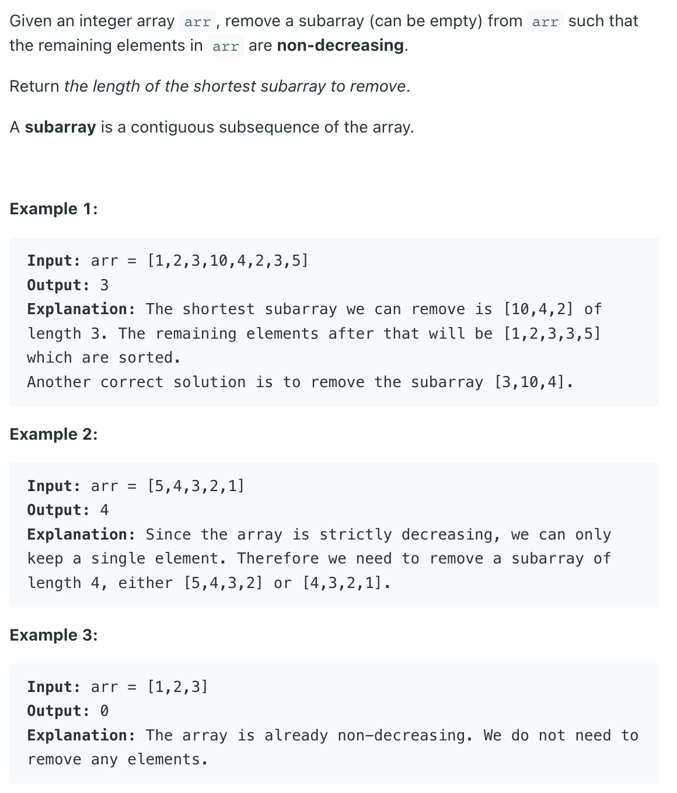
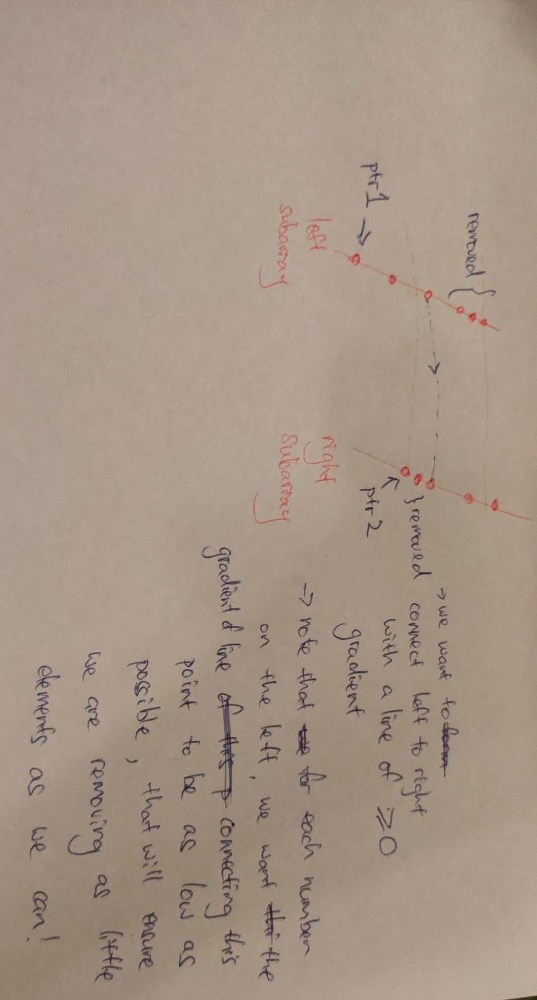

### Question



### My solution
explanation:
- the first part is easy, we find the first indexes from left and right that violates the non decreasing property
- so we have 3 subarrays now (left, right and middle unsorted part)
- the answer could be the removing left + middle or removing right + middle, so we need to initalize our answer to the minimum of these 2 lengths
- the final possibility is that only middle needs to be removed, but it is possible that left and right do not form a non-decreasing sequence after they are merged, because left[-1] could be greater than right[0]
- how to find the minimum number of elements to be sliced off from the end of left subarray and start of right subarray so that they can be concatenated?
- turns out you can do this in linear time using 2 pointers
- initialize ptr1=left[0], ptr2=right[0]
  - keep moving ptr1 until we reach a number > ptr2
  - check img for the rest of the explanation


```python
import sys

class Solution:
    # answer taken from https://www.geeksforgeeks.org/length-of-smallest-subarray-to-be-removed-such-that-the-remaining-array-is-sorted/
    # the 2 pointer logic is tricky to prove for correctness :/
    def findLengthOfShortestSubarray(self, arr: List[int]) -> int:
        # To store the result
        minlength = sys.maxsize

        left = 0
        right = len(arr) - 1

        # Calculate the possible length of
        # the sorted subarray from left
        while left < right and arr[left + 1] >= arr[left]:
            left += 1

        # Array is sorted
        if left == len(arr) - 1:
            return 0

        # Calculate the possible length of
        # the sorted subarray from left
        while right > left and arr[right-1] <= arr[right]:
            right -= 1

        # Update the result
        minlength = min(len(arr) - left - 1, right)
        # print(left, right)
        # Calculate the possible length
        # in the middle we can delete
        # and update the result
        j = right
        for i in range(left + 1):
            print((i, j))
            if arr[i] <= arr[j]:
                # print("condition1")
                # Update the result
                minlength = min(minlength, j - i - 1)
            elif j < len(arr) - 1:
                # print("condition2")
                j += 1
            else:
                # print("break at {}".format(i, j))
                break

        # Return the result
        return minlength
```
