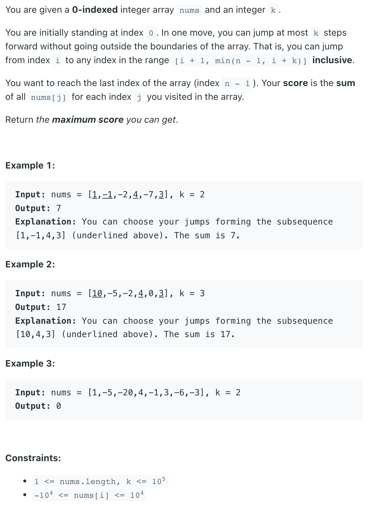

### Question



### My solution
O(n log k) 
O(n) soluation is possible
```python
from sortedcontainers import SortedList

class Solution:
    def maxResult(self, nums: List[int], k: int) -> int:
        if k == 1:
            return sum(nums)
        if len(nums) == 1:
            return sum(nums)
        
        n = len(nums)
        max_sum_from_i = [None for _ in nums]
        max_sum_from_i[-1]  = nums[-1]
        best_jumps = SortedList([nums[-1]], key=lambda v: -1*v)
                
        for i in range(n-2, -1, -1):
            # print(i, best_jumps)
            max_sum_from_i[i] = nums[i]+best_jumps[0]
            best_jumps.add(max_sum_from_i[i])
            
            if len(best_jumps) > k:
                best_jumps.discard(max_sum_from_i[i+k])
        
        # print(max_sum_from_i)
        return max_sum_from_i[0]
```
