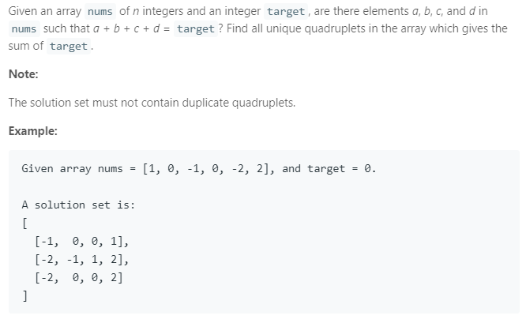

### Question



### My solution

```python
class Solution:
    def checkValid(self, tup1, tup2):
        if len(set(tup1).intersection(set(tup2))) > 0:
            return False
        else:
            return True
    
    def fourSum(self, nums, target):
        """
        :type nums: List[int]
        :type target: int
        :rtype: List[List[int]]
        """
        # initialization
        solution_set = set()
        solution_ls = []
        
        # key is sum of the pair, value is a list of sets
        pairs = {}
        
        for i in range(len(nums)):
            for j in range(i+1, len(nums)):
                pair = tuple([i, j])
                pair_sum = nums[i] + nums[j]
                
                if pair_sum in pairs:
                    pairs[pair_sum].add(pair)
                else:
                    pairs[pair_sum] = set([pair])
                    
        checked = set()
        
        for pair_sum in pairs:
            if (target - pair_sum in pairs):
                if pair_sum in checked or (target - pair_sum) in checked:
                    continue    
                
                if (pair_sum == target - pair_sum) and len(pairs[pair_sum]) > 1:
                    checked.add(pair_sum)
                    ls = list(pairs[pair_sum])
                    
                    for i in range(len(ls)):
                        for j in range(i+1, len(ls)):
                            tup1, tup2 = ls[i], ls[j]
                                                        
                            if self.checkValid(tup1, tup2):   
                                merged_ls = [nums[tup1[0]], nums[tup1[1]], nums[tup2[0]], nums[tup2[1]]]
                                solution_set.add(tuple(sorted(merged_ls)))
                    
                else:
                    checked.add(pair_sum)
                    checked.add(target - pair_sum)
                    
                    for pair1 in pairs[pair_sum]:
                        for pair2 in pairs[target - pair_sum]:
                            tup1, tup2 = pair1, pair2
                                                        
                            if self.checkValid(tup1, tup2):   
                                merged_ls = [nums[tup1[0]], nums[tup1[1]], nums[tup2[0]], nums[tup2[1]]]
                                solution_set.add(tuple(sorted(merged_ls)))
        
        for tup in solution_set:
            solution_ls.append(list(tup))
        
        return solution_ls
                
```
