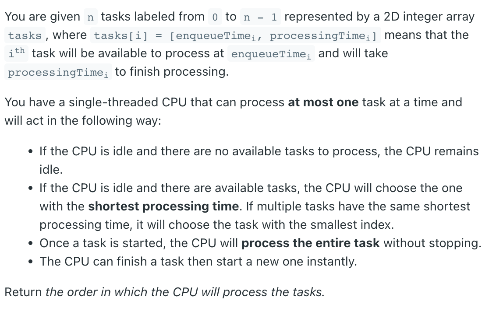

### Question



### My solution
Level order traversal with a small modification.
```python
import heapq

class Solution:
    def getOrder(self, tasks: List[List[int]]) -> List[int]:
        # list of (enqueue_time, processing_time, task_id)
        tasks = [(t[0], t[1], i) for i, t in enumerate(tasks)]
        tasks = sorted(tasks, key=lambda t: t[0])
        
        queue = []
        processed = []
        
        ts = tasks[0][0]
        i = 0
        while i < len(tasks) or len(queue) > 0:
            while i < len(tasks) and tasks[i][0] <= ts:
                heapq.heappush(queue, (tasks[i][1], tasks[i][2], tasks[i][0]))
                i += 1
            if len(queue) > 0:
                task_duration, task_id, _ = heapq.heappop(queue)
                processed.append(task_id)
                ts += task_duration
            if len(queue) == 0 and i < len(tasks) and tasks[i][0] > ts:
                heapq.heappush(queue, (tasks[i][1], tasks[i][2], tasks[i][0]))
                ts = tasks[i][0]
                i += 1
        
        return processed
```
