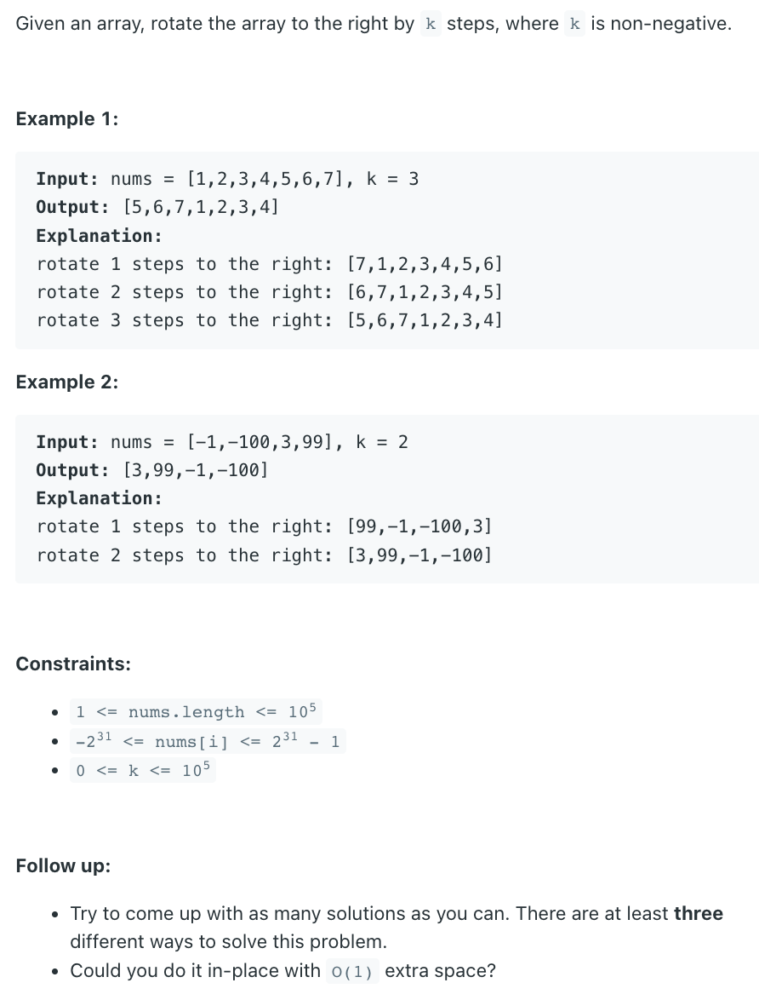

### Question



### My solution
```python
import math

class Solution:
    def rotate(self, nums: List[int], k: int) -> None:
        """
        Do not return anything, modify nums in-place instead.
        """
        n = len(nums)
        if n <= 1:
            return
        
        k = k % n
        if k == 0:
            return
        
        def rotate_helper(nums: List[int], small_k: int):
            def swap(i, j):
                tmp = nums[i]
                nums[i] = nums[j]
                nums[j] = tmp

            i = 0
            for _ in range(n-1):
                swap(i, i-small_k)
                i -= small_k
                if i < 0:
                    i += n
                    
        rotations = k
        recent = k
        while rotations > 0:
            for i in range(min(rotations, recent), 0, -1):
                if math.gcd(n, i) == 1 or i == 1:
                    rotate_helper(nums, i)
                    rotations -= i
                    recent = i
                    break
```

### Better solution
```python
class Solution3:
    def rotate(self, nums, k):
        """
        :type nums: List[int]
        :type k: int
        :rtype: None Do not return anything, modify nums in-place instead.
        """
        k = k % len(nums)
        count = 0
        start = 0
        while count < len(nums):
            current = start 
            prev = nums[start] #store the value in the position
            
            while True:
                next = (current + k) % len(nums) #
                temp = nums[next] #store it temporaly 
                nums[next] = prev #overide the next 
                prev = temp #reset prev
                current = next #reset current
                count += 1

                if start == current:
                    break 
            
            start += 1
```
