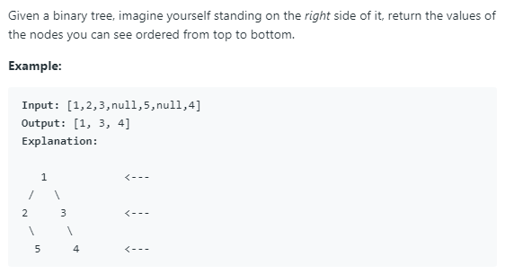

### Question



### My solution
```python
from collections import deque

# Definition for a binary tree node.
# class TreeNode(object):
#     def __init__(self, x):
#         self.val = x
#         self.left = None
#         self.right = None

class Solution(object):
    def rightSideView(self, root):
        """
        :type root: TreeNode
        :rtype: List[int]
        """
        # idea:
        # 1. perform level order traversal
        # 2. not possible to exit early, imagine if we have a tree that looks like this
        #  
        #                 O
        #              O     O
        #           O     O
        #        O     O
        #    O     O
        # 
        # 3. we have no choice but to traverse the entire tree
        
        # edge case
        if root is None:
            return []
        
        else:
            # list to keep track of right hand side nodes, to be returned
            self.solution_ls = [root.val]
            
            # for level order traversal
            curr_level = 1
            queue = deque([(root, 1)])
            N = len(queue)
            
            # main loop (level order traversal)
            while N > 0:
                node, level = queue.pop()
                
                if level > curr_level:
                    self.solution_ls.append(node.val)
                    curr_level = level
                
                if node.right:
                    queue.appendleft((node.right, curr_level + 1))
                if node.left:
                    queue.appendleft((node.left, curr_level + 1))
                
                N = len(queue)
            
            return self.solution_ls
```