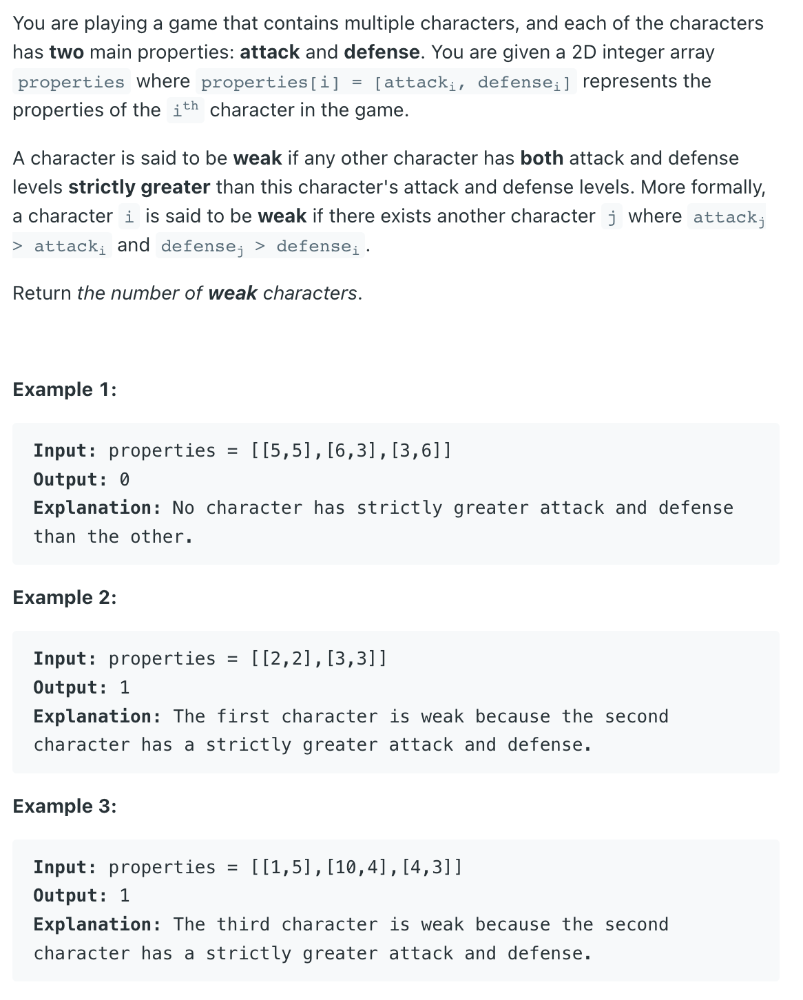

### Question



### My solution
```python
class Solution:
    def numberOfWeakCharacters(self, properties: List[List[int]]) -> int:
        if len(properties) <= 1:
            return 0
        
        properties = sorted(properties, key=lambda r: r[0])
        
        attack_vals_dict = {}
        attack_vals_first_occurrence = []
        for i, p in enumerate(properties):
            if p[0] not in attack_vals_dict:
                attack_vals_dict[p[0]] = len(attack_vals_first_occurrence)
                attack_vals_first_occurrence.append(i)
        
        if len(attack_vals_dict) == 1:
            return 0
        
        max_defense_from_right = [p[1] for p in properties]
        for i in range(len(properties)-2, -1, -1):
            max_defense_from_right[i] = max(max_defense_from_right[i], max_defense_from_right[i+1])
        
        num_weak_chars = 0
        for i, p in enumerate(properties):
            attack, defense = p[0], p[1]
            
            # if attack is highest, then not possible
            if attack == properties[attack_vals_first_occurrence[-1]][0]:
                break
            
            next_higher_attack_occurrence = attack_vals_first_occurrence[attack_vals_dict[attack]+1]
            if max_defense_from_right[next_higher_attack_occurrence] > defense:
                num_weak_chars += 1
                
        return num_weak_chars
```

### Better solution(s)
```python
class Solution:
    def numberOfWeakCharacters(self, properties: List[List[int]]) -> int:
        
        properties.sort(key=lambda x: (-x[0],x[1]))
        
        ans = 0
        curr_max = 0
        
        for _, d in properties:
            if d < curr_max:
                ans += 1
            else:
                curr_max = d
        return ans
```
```python
class Solution:
    def numberOfWeakCharacters(self, properties: List[List[int]]) -> int:
        
        properties.sort(key=lambda x: (x[0], -x[1]))
        
        stack = []
        ans = 0
        
        for a, d in properties:
            while stack and stack[-1] < d:
                stack.pop()
                ans += 1
            stack.append(d)
        return ans
```
