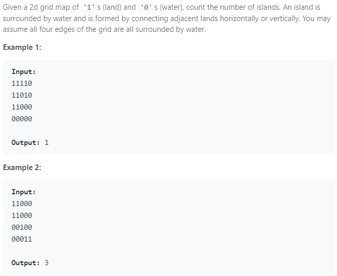

### Question



### My solution
```python
class Solution(object):
    def traverse(self, i, j, grid):
        if i < 0 or j < 0 or i >= self.N or j >= self.M:
            return
        elif self.table[i][j] or grid[i][j] == '0':
            self.table[i][j] = True
            return
        else:
            self.table[i][j] = True
            self.traverse(i+1, j, grid)
            self.traverse(i-1, j, grid)
            self.traverse(i, j-1, grid)
            self.traverse(i, j+1, grid)
        
    def numIslands(self, grid):
        """
        :type grid: List[List[str]]
        :rtype: int
        """
        self.N, self.M = len(grid), 0
        count = 0
        
        if self.N > 0:
            self.M = len(grid[0])
        
        self.table = [[False for i in range(self.M)] for i in range(self.N)]
        
        for i in range(self.N):
            for j in range(self.M):
                if not self.table[i][j]:
                    if grid[i][j] == '1':
                        self.traverse(i, j, grid)
                        count += 1
    
        return count
```