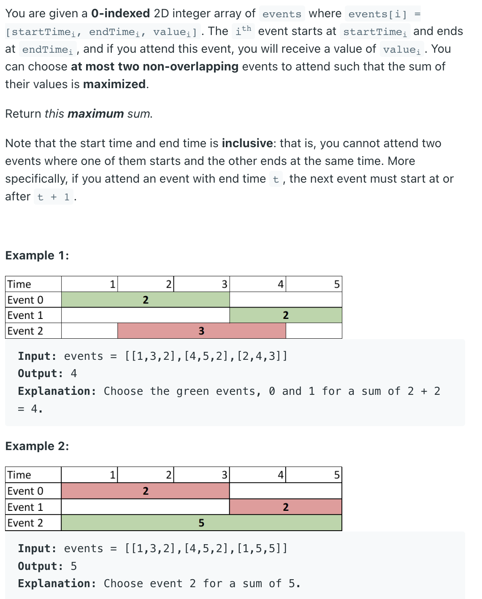

### Question



### My solution
```python
import sys


class Solution:
    def maxTwoEvents(self, events: List[List[int]]) -> int:
        times = []
        for i, e in enumerate(events):
            # event_id, start_time, time_type (0 for start, 1 for end)
            times.append((i, e[0], 0))
            
            # event_id, end_time, time_type (0 for start, 1 for end)
            times.append((i, e[1], 1))
            
        times = sorted(times, key=lambda t: (t[1], t[2]))
        
        # print(times)
        
        max_from_left = [-sys.maxsize-1 for _ in times]
        for i in range(len(times)):
            val = -sys.maxsize-1
            if times[i][2] == 1:
                val = events[times[i][0]][2]
            if i > 0:
                val = max(val, max_from_left[i-1])
            max_from_left[i] = max(val, max_from_left[i])
            
        # print(max_from_left)
        
        max_from_right = [-sys.maxsize-1 for _ in times]
        for i in range(len(times)-1, -1, -1):
            val = -sys.maxsize-1
            if times[i][2] == 0:
                val = events[times[i][0]][2]
            if i < len(times)-1:
                val = max(val, max_from_right[i+1])
            max_from_right[i] = max(val, max_from_right[i])
            
        # print(max_from_right)
        
        result = 0
        for i in range(len(times)):
            result = max(result, max_from_left[i]+max_from_right[i], max_from_left[i], max_from_left[i])
            
        return result
```
