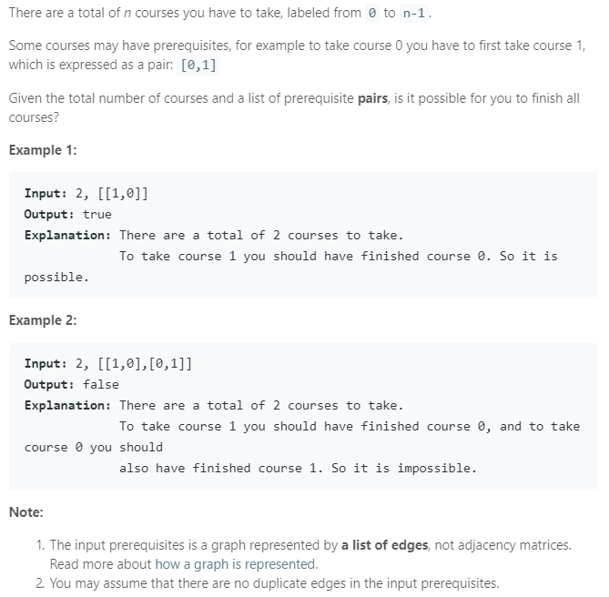

### Question



### My solution
I did this referring to [GeeksForGeeks](https://www.geeksforgeeks.org/detect-cycle-in-a-graph/)
```python
from collections import defaultdict

class Solution(object):
    def __init__(self):
        self.graph = defaultdict(list)
        self.V = None
        
    def buildGraph(self, prerequisites, numCourses):
        self.V = numCourses
        for pair in prerequisites:
            parent, child = pair
            self.graph[parent].append(child)
    
    def isCyclicUtil(self, node, visited, recursed):
        visited[node] = True
        recursed[node] = True
        
        for neighbor in self.graph[node]:
            if not visited[neighbor]:
                if self.isCyclicUtil(neighbor, visited, recursed):
                    return True
            elif recursed[neighbor]:
                return True
        
        recursed[node] = False
        return False
    
    def canFinish(self, numCourses, prerequisites):
        """
        :type numCourses: int
        :type prerequisites: List[List[int]]
        :rtype: bool
        """
        self.buildGraph(prerequisites, numCourses)
        
        # detect if cycle exits
        visited = [False for i in range(self.V)]
        recursed = [False for i in range(self.V)]

        for node in range(self.V):
            if not visited[node]:
                if self.isCyclicUtil(node, visited, recursed):
                    return False

        return True
```