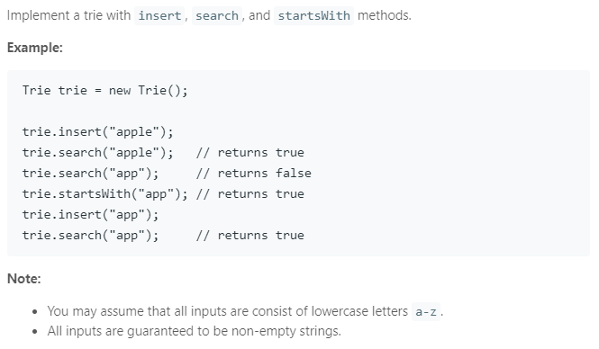

### Question



### My solution
```python
class Trie(object):

    def __init__(self):
        """
        Initialize your data structure here.
        """
        self.children = {}
        self.exist = False

    def insert(self, word):
        """
        Inserts a word into the trie.
        :type word: str
        :rtype: void
        """
        node = self
        for char in word:
            if char not in node.children:
                node.children[char] = Trie()
            node = node.children[char]
        node.exist = True
        
    def search(self, word):
        """
        Returns if the word is in the trie.
        :type word: str
        :rtype: bool
        """
        node = self
        for char in word:
            if char in node.children:
                node = node.children[char]
            else:
                return False
        
        return node.exist

    def startsWith(self, prefix):
        """
        Returns if there is any word in the trie that starts with the given prefix.
        :type prefix: str
        :rtype: bool
        """
        node = self
        for char in prefix:
            if char in node.children:
                node = node.children[char]
            else:
                return False
        return True
        
# Your Trie object will be instantiated and called as such:
# obj = Trie()
# obj.insert(word)
# param_2 = obj.search(word)
# param_3 = obj.startsWith(prefix)
```