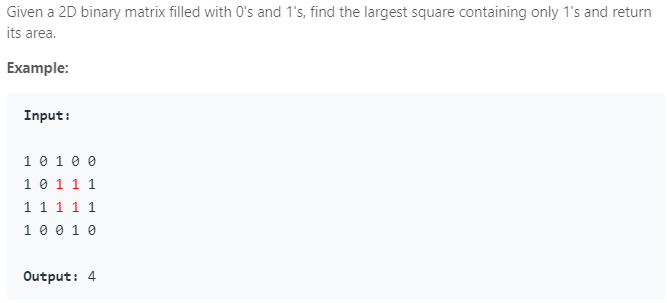

### Question



### My solution
```python
class Solution(object):
    def maximalSquare(self, matrix):
        """
        :type matrix: List[List[str]]
        :rtype: int
        """
        N, M = len(matrix), None
        self.table = None
        
        if N == 0:
            return 0
        
        M = len(matrix[0])            

        self.table = [[0 for i in range(M)] for j in range(N)]
        self.table[0][0] = int(matrix[0][0])
        
        for i in range(N):
            self.table[i][0] = int(matrix[i][0])
            
        for i in range(M):
            self.table[0][i] = int(matrix[0][i])
            
        for i in range(1, N):
            for j in range(1, M):
                if int(matrix[i][j]) == 0:
                    self.table[i][j] = 0
                elif self.table[i-1][j-1] == 0 or self.table[i][j-1] == 0 or self.table[i-1][j] == 0:
                    self.table[i][j] = 1
                else:
                    self.table[i][j] = min(self.table[i-1][j-1], self.table[i-1][j], self.table[i][j-1]) + 1
                
        return max([max(ls) for ls in self.table]) ** 2
```
Space complexity can be further improved to O(width of matrix).