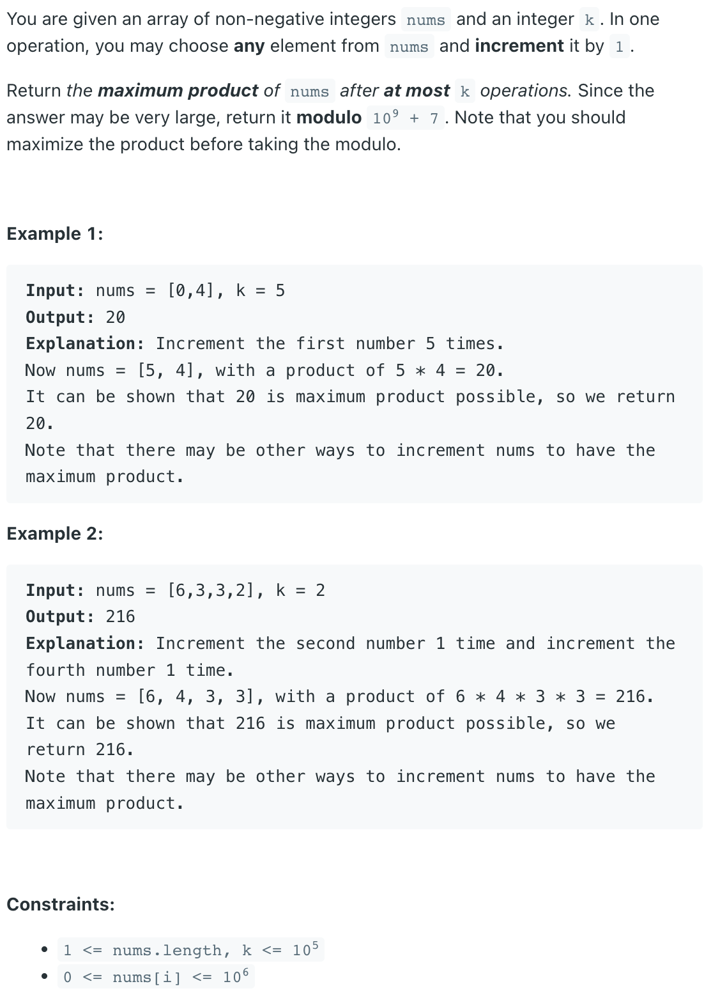

### Question



### My solution
Heap
```python
from sortedcontainers import SortedList
from operator import mul
import heapq


class Solution:
    def maximumProduct(self, nums: List[int], k: int) -> int:
        heapq.heapify(nums)
        for _ in range(k):
            min_val = heapq.heappop(nums)
            heapq.heappush(nums, min_val+1)
            
        # (ab) mod (n) = (a mod n) * (b mod n)
        N = 10**9 + 7
        result = 1
        for p in [x % N for x in nums]:
            result = (result*p) % N
        return result
```
### My solution
SortedList (quite a bit slower than Heap, probably because its operations are only approximately O(log N))
```python
from sortedcontainers import SortedList
from operator import mul


class Solution:
    def maximumProduct(self, nums: List[int], k: int) -> int:
        ls = SortedList(nums)
        for _ in range(k):
            min_val = ls[0]
            ls.discard(min_val)
            ls.add(min_val+1)
            
        # (ab) mod (n) = (a mod n) * (b mod n)
        N = int(math.pow(10, 9) + 7)
        result = 1
        for p in [x % N for x in ls]:
            result = (result*p) % N
        return result
```
