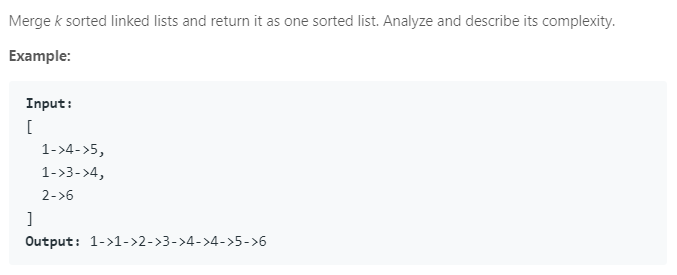

### Question



### My solution

```python
# Definition for singly-linked list.
# class ListNode(object):
#     def __init__(self, x):
#         self.val = x
#         self.next = None

from collections import defaultdict

class Solution(object):
    def mergeKLists(self, lists):
        """
        :type lists: List[ListNode]
        :rtype: ListNode
        """
        # time complexity: O(N) + O(k log k), where k is the number of distinct values
        # N is the total num of nodes
        val_count =  defaultdict(int)
        
        for head in lists:
            p = head
            
            while p:
                val_count[p.val] = val_count.get(p.val, 0) + 1
                p = p.next
        
        # create dummy node
        head = ListNode(-1)
        p = head
        
        for val in sorted(val_count.keys()):
            for i in range(val_count[val]):
                node = ListNode(val)
                p.next = node
                p = node
        
        return head.next
            
```