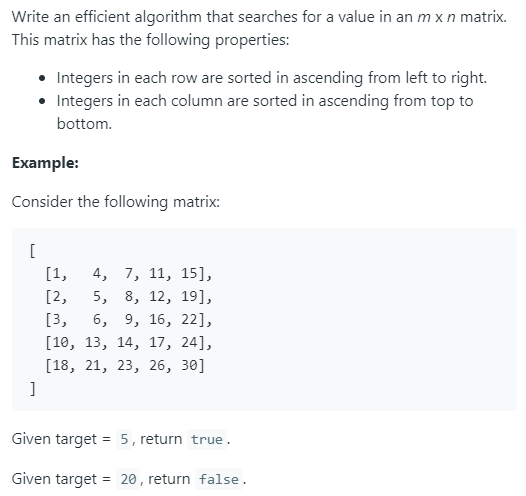

### Question



### My solution
```python
class Solution(object):
    def search_matrix(self, matrix, target, row1, col1, height, width):
        # edge case
        if height == 0 or width == 0:
            return False
        
        # special case
        if height <= 2 and width <= 2:
            for i in range(height):
                for j in range(width):
                    if matrix[row1 + i][col1 + j] == target:
                        return True
            return False
        
        # early exit
        if target < matrix[row1][col1] or target > matrix[row1 + height - 1][col1 + width - 1]:
            return False
        
        height_mid, width_mid = int(0.5 * height), int(0.5 * width)
        if matrix[row1 + height_mid][col1 + width_mid] == target:
            return True
        else:
            # search bottom left
            if row1 + height_mid + 1 < len(matrix) and self.search_matrix(matrix, 
                                                                          target, 
                                                                          row1 + height_mid + 1, 
                                                                          col1, height - height_mid - 1, width_mid + 1):
                return True
            # search upper right
            if col1 + width_mid + 1 < len(matrix[0]) and self.search_matrix(matrix, 
                                                                            target, 
                                                                            row1, 
                                                                            col1 + width_mid + 1, height_mid + 1, 
                                                                            width - width_mid - 1):
                return True
            
            if matrix[row1 + height_mid][col1 + width_mid] < target:
                # search bottom right
                if row1 + height_mid + 1 < len(matrix) and col1 + width_mid + 1 < len(matrix[0]):
                    if self.search_matrix(matrix, target, row1 + height_mid + 1, 
                                          col1 + width_mid + 1, height - height_mid - 1, width - width_mid - 1):
                        return True
            elif matrix[row1 + height_mid][col1 + width_mid] > target:
                # search upper left
                if self.search_matrix(matrix, 
                                      target, 
                                      row1, col1, height_mid + 1, width_mid + 1):
                    return True
            return False
    
    def searchMatrix(self, matrix, target):
        """
        :type matrix: List[List[int]]
        :type target: int
        :rtype: bool
        """
        if len(matrix) == 0:
            return False
        if len(matrix[0]) == 0:
            return False

        return self.search_matrix(matrix, target, 0, 0, len(matrix), len(matrix[0]))
```