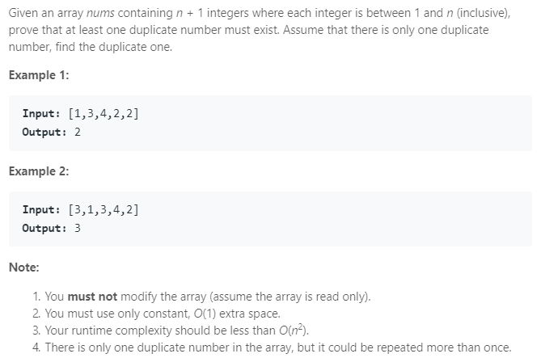

### Question



### O(n log n) solution

```python
class Solution(object):
    def findDuplicate(self, nums):
        """
        :type nums: List[int]
        :rtype: int
        """
        # sort 
        nums.sort()
        
        for i in range(1, len(nums)):
            if nums[i] == nums[i-1]:
                return nums[i]

```

### O(n) solution

```python

class Solution(object):
    def findDuplicate(self, nums):
        """
        :type nums: List[int]
        :rtype: int
        """
        s = 0
        
        for i in nums:
            # check if i-th bit is set
            # if not, set it
            # otherwise, we have found a duplicate
            
            if s >> i & 1:   
                return i
            else:
                s ^= 1 << i     
```