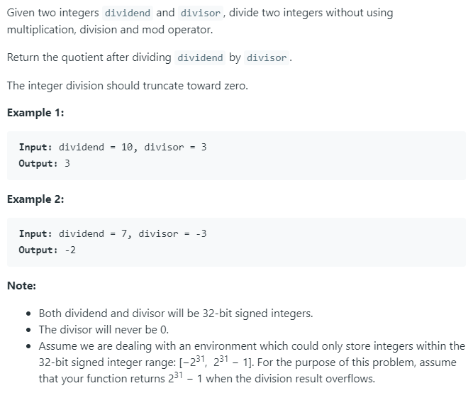

### Question



### My solution
```python
def divide_single_digit(dividend, divisor):
    summation = 0
    counter = 0
    
    while summation + divisor <= dividend:
        summation += divisor
        counter += 1
    
    return counter, dividend - summation

class Solution(object):
    def divide(self, dividend, divisor):
        """
        :type dividend: int
        :type divisor: int
        :rtype: int
        """  
        if dividend == 0:
            return 0
        if divisor == 1:
            return min(dividend, 2147483647)
        if divisor == -1:
            return min(0 - dividend, 2147483647)
        
        result_sign = 1
        if (dividend < 0 and divisor > 0):
            result_sign = -1
            dividend = 0 - dividend
            
        elif (dividend > 0 and divisor < 0):
            result_sign = -1
            divisor = 0 - divisor
        
        elif (dividend < 0 and divisor < 0):
            dividend = 0 - dividend
            divisor = 0 - divisor
            
        if divisor > dividend:
            return 0
            
        results_str = ''
        dividend_str = str(dividend)
        divisor_str = str(divisor)
        result = None
        
        if len(dividend_str) == len(divisor_str):
            result, _ = divide_single_digit(dividend, divisor)
        else:
            partial_result, remainder = divide_single_digit(int(dividend_str[0 : len(divisor_str) + 1]), divisor)
            results_str += str(partial_result)
            
            for i in range(len(divisor_str) + 1, len(dividend_str)):
                remainder = (remainder << 3) + (remainder << 1)
                remainder = remainder + int(dividend_str[i])
                
                partial_result, remainder = divide_single_digit(remainder, divisor)
                results_str += str(partial_result)
                
            result = int(results_str)
            
        if result_sign == -1:
            result = 0 - result
        return result
```