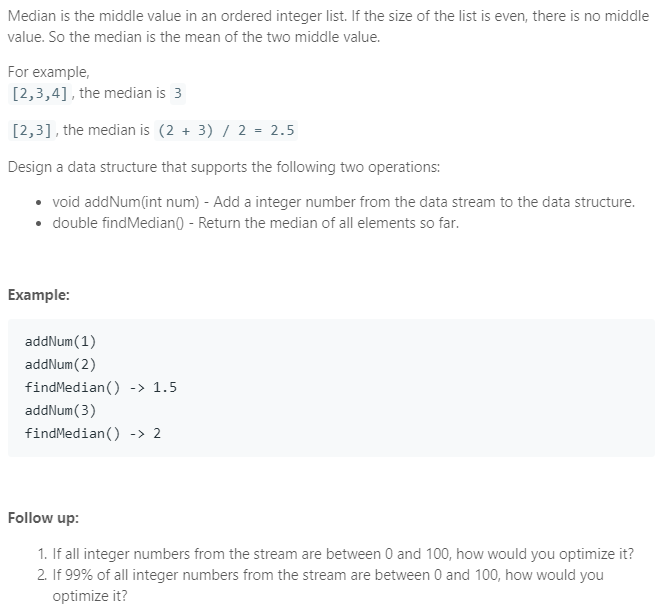

### Question



### My solution
Basic idea: use two heaps, one max heap and one min heap.
```python
import heapq as hq

class MedianFinder(object):

    def __init__(self):
        """
        initialize your data structure here.
        """
        # this is a max heap
        self.left_heap = []
        
        # this is a min heap
        self.right_heap = []
        

    def addNum(self, num):
        """
        :type num: int
        :rtype: void
        """
        # basic idea: ensure that right heap is either same size as left heap OR
        # has one more node than left heap
        
        if len(self.left_heap) > 0 and len(self.right_heap) > 0:
            left_max = -1 * self.left_heap[0]
            right_min = self.right_heap[0]

            if len(self.left_heap) == len(self.right_heap):
                if num < left_max:
                    hq.heappop(self.left_heap)
                    hq.heappush(self.left_heap, -1 * num)
                    hq.heappush(self.right_heap, left_max)

                else:
                    hq.heappush(self.right_heap, num)
            else:
                if num > right_min:
                    hq.heappop(self.right_heap)
                    hq.heappush(self.right_heap, num)
                    hq.heappush(self.left_heap, -1 * right_min)

                else:
                    hq.heappush(self.left_heap, -1 * num)
                    
        else:
            if len(self.left_heap) == 0 and len(self.right_heap) == 0:
                hq.heappush(self.right_heap, num)
        
            else:
                right_min = self.right_heap[0]

                if num > right_min:
                    hq.heappop(self.right_heap)
                    hq.heappush(self.right_heap, num)
                    hq.heappush(self.left_heap, -1 * right_min)

                else:
                    hq.heappush(self.left_heap, -1 * num)
    
    def findMedian(self):
        """
        :rtype: float
        """
        if len(self.left_heap) == len(self.right_heap):
            return 0.5 * (-1 * self.left_heap[0] + self.right_heap[0])
        else:
            return self.right_heap[0]


# Your MedianFinder object will be instantiated and called as such:
# obj = MedianFinder()
# obj.addNum(num)
# param_2 = obj.findMedian()
```
