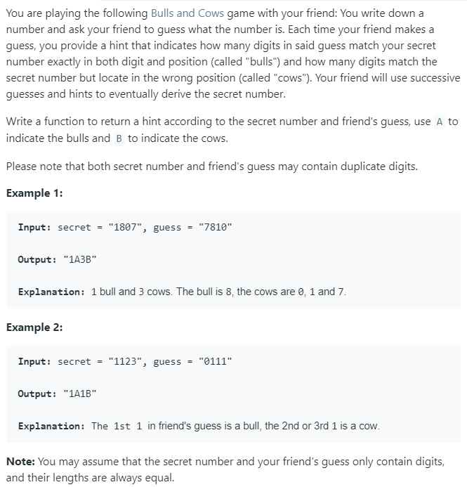

### Question



### My solution
```python
class Counter(object):
    def __init__(self):
        self.dict = {}
    
    def contains(self, item):
        return item in self.dict
    
    def add(self, item):
        self.dict[item] = self.dict.get(item, 0) + 1
        
    def decrease(self, item):
        if self.contains(item):
            self.dict[item] = self.dict[item] - 1
        if self.dict[item] == 0:
            self.dict.pop(item, None)
            
    def freq(self, item):
        if self.contains(item):
            return self.dict[item]
        else:
            return 0

class Solution(object):
    def getHint(self, secret, guess):
        """
        :type secret: str
        :type guess: str
        :rtype: str
        """
        N = len(secret)
        
        if N == 0:
            return ""
        
        counter_A = Counter()
        counter_B = Counter()
        num_A = 0
        num_B = 0
        
        for i, char in enumerate(secret):
            if guess[i] == secret[i]:
                num_A += 1
                continue
                
            if counter_A.contains(guess[i]):
                counter_A.decrease(guess[i])
                num_B += 1
            else:
                counter_B.add(guess[i])
            
            if counter_B.contains(char):
                counter_B.decrease(char)
                num_B += 1
            else:
                counter_A.add(char)       
            
        for char in counter_B.dict:
            if counter_A.contains(char):
                num_B += min(counter_B.freq(char), counter_A.freq(char))
                
        return "{}A{}B".format(num_A, num_B)
            
        
```