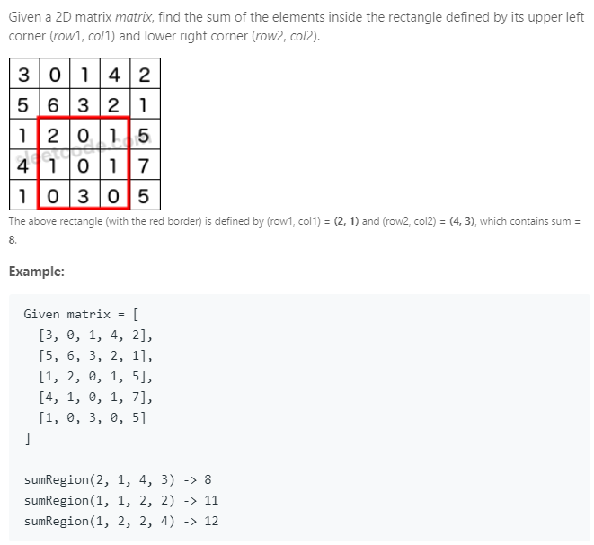

### Question



### My solution
```python
class NumMatrix(object):
    def __init__(self, matrix):
        """
        :type matrix: List[List[int]]
        """
        
        N, M = len(matrix), None
        self.table = None
        
        if N > 0:
            M = len(matrix[0])            
        
            self.table = [[0 for i in range(M)] for j in range(N)]
            self.table[0][0] = matrix[0][0]

            for i in range(1, M):
                self.table[0][i] = self.table[0][i-1] + matrix[0][i]

            for i in range(1, N):
                self.table[i][0] = self.table[i-1][0] + matrix[i][0]

            for i in range(1, N):
                for j in range(1, M):
                    self.table[i][j] = matrix[i][j] + self.table[i][j-1] + self.table[i-1][j] - self.table[i-1][j-1] 
        
    def sumRegion(self, row1, col1, row2, col2):
        """
        :type row1: int
        :type col1: int
        :type row2: int
        :type col2: int
        :rtype: int
        """
        area = self.table[row2][col2]

        if row1 > 0:
            area -= self.table[row1-1][col2]
        if col1 > 0:
            area -= self.table[row2][col1-1]
        if row1 > 0 and col1 > 0:
            area += self.table[row1-1][col1-1]

        return area

# Your NumMatrix object will be instantiated and called as such:
# obj = NumMatrix(matrix)
# param_1 = obj.sumRegion(row1,col1,row2,col2)
```