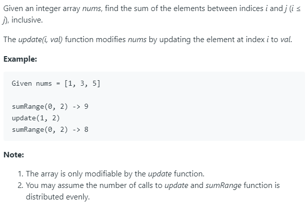

### Question



### My solution
I referred to [this page.](https://www.geeksforgeeks.org/segment-tree-set-1-sum-of-given-range/)
```python
class Node(object):
    def __init__(self):
        self.left_idx = None
        self.right_idx = None
        self.val = None
        self.left = None
        self.right = None

class NumArray(object):

    def __init__(self, nums):
        """
        :type nums: List[int]
        """
        self.N = len(nums)
        
        if self.N > 0:
            self.ls = nums
            self.root = Node()
            self.root.left_idx, self.root.right_idx = 0, self.N - 1
            self.build_tree(self.root)

    def build_tree(self, node):
        if node.left_idx == node.right_idx:
            node.val = self.ls[node.left_idx]
            
        elif node.left_idx + 1 == node.right_idx:
            node.val = self.ls[node.left_idx] + self.ls[node.left_idx + 1]
            
            # build left child
            node.left = Node()
            node.left.left_idx, node.left.right_idx = node.left_idx, node.left_idx
            node.left.val = self.ls[node.left_idx]
            
            # build right child
            node.right = Node()
            node.right.left_idx, node.right.right_idx = node.right_idx, node.right_idx
            node.right.val = self.ls[node.right_idx]
            
        else:
            mid = int(0.5 * (node.left_idx + node.right_idx))
            
            # build left child
            node.left = Node()
            node.left.left_idx, node.left.right_idx = node.left_idx, mid
            self.build_tree(node.left)
            
            # build right child
            node.right = Node()
            node.right.left_idx, node.right.right_idx = mid + 1, node.right_idx
            self.build_tree(node.right)
            
            # compute own value
            node.val = node.left.val + node.right.val
    
    def update_node(self, node, idx, diff):
        if node is None:
            return
        
        if node.left_idx <= idx and node.right_idx >= idx:
            node.val += diff
            self.update_node(node.left, idx, diff)
            self.update_node(node.right, idx, diff)
            return
        else:
            return

    def getSum(self, node, i, j):
        if i <= node.left_idx and j >= node.right_idx:
            return node.val
        elif i > node.right_idx or j < node.left_idx:
            return 0
        else:
            return self.getSum(node.left, i, j) + self.getSum(node.right, i, j)
        
    def update(self, i, val):
        """
        :type i: int
        :type val: int
        :rtype: None
        """
        if self.N > 0:
            self.update_node(self.root, i, val - self.ls[i])
            self.ls[i] = val

    def sumRange(self, i, j):
        """
        :type i: int
        :type j: int
        :rtype: int
        """
        if self.N > 0:
            return self.getSum(self.root, i, j)
        else:
            return 0

# Your NumArray object will be instantiated and called as such:
# obj = NumArray(nums)
# obj.update(i,val)
# param_2 = obj.sumRange(i,j)
```