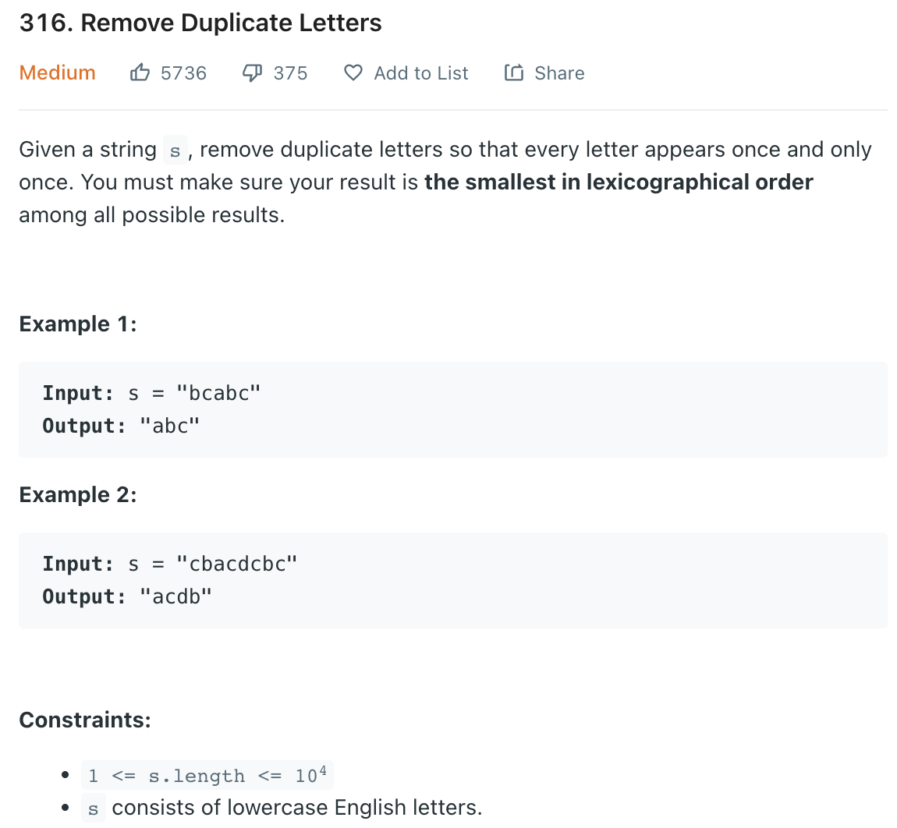

### Question



### My solution
```python
from collections import Counter

class Solution:
    def removeDuplicateLetters(self, s: str) -> str:
        freq = Counter(s)
        st = []
        taken = set()
        for letter in s:
            if letter not in taken:
                while len(st) > 0 and st[-1] > letter and freq[st[-1]] > 0:
                    taken.remove(st.pop())
                taken.add(letter)
                st.append(letter)
            freq[letter] -= 1
        return ''.join(st)
        
# proof of correctness? 
# - not a super rigorous proof, but good enough to give the intuition
# - for simplicity, "increasing" = "lexicographically increasing"
# 
# 1. consider a solution from the our greedy algorithm
# 2. note that 
#       - if greedy solution is increasing from start to end, it must be the best solution
#       - if greedy solution is not increasing from start to end, it must have taken letters from 1 or more last occurring positions (LOP) for some letters 
#           - it would look something like this 
#             [1st increasing seq ending with a letter from LOP] + [2nd increasing seq ending with a letter from LOP] + ...
# 3. consider the case where there are 2 increasing seqs (seq A and seq B)
#       - if seq A is of len 1 (only consists of the LOP letter), then is it possible for us to come up with a different solution which is smaller than our greedy solution? 
#           - such a solution would look like [l1, l2, ... ] + [LOP of seq A] + [...] and [l1, l2, ... ] has to be lower than LOP of seq A, but this is clearly not possible because our greedy algorithm would not have popped [l1, l2, ... ] from the stack
#       - if seq A is of len > 1, then is it possible for us to come up with a different solution which is smaller than our greedy solution?
#           - clearly, if this solution also has a pattern like [l1, l2, ... ] + [LOP of seq A] + [...], our greedy algorithm's solution would definitely be smaller or equal (from the definition)
#           - so what if it consists the letter at LOP of seq, but the alternative solution takes this letter from an earlier position in the original sequence?
#               - eg.
#                   - let's use numbers to represent letters
#                   - original_sequence = [9, 9, 10, 9, 5, 5, 9, 10, 1, 2, 1, 4, 5]
#                   - greedy solution [5, 9, 10, 1, 2, 4] = [5, 9, 10] + [1, 2, 4] 
#                       - the 10 here is from the LOP of 10
#                   - because [5, 9, 10] is taken from original_sequence[0:8], if the alternative solution used a 10 from the non LOP position (ie. original_sequence[0:3]), it is impossible for a increasing subsequence from original_sequence[0:3] to be lexicographically lower than a increasing subsequence from original_sequence[0:8], given that the both end with 10!
# 4. you can repeat this logic of the remaining sequences and find that the best solution must be the same with the greedy solution
# 
# 
# 
#
# 
# 
# 
# 
# 
#
# 
# 
# 
# 
# 
#
```
