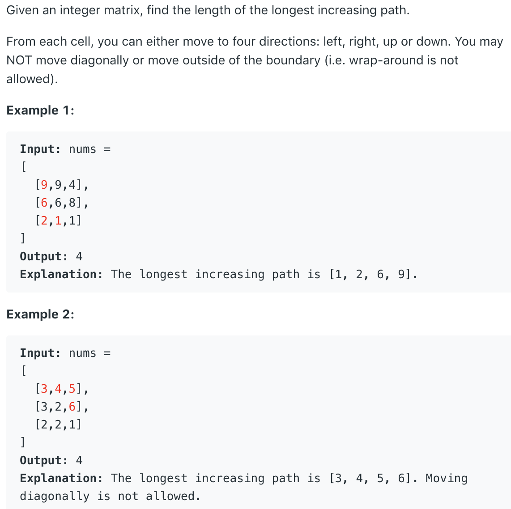

### Question



### My solution
Union find by rank.
```python
class Solution:
    def longestIncreasingPath(self, matrix: List[List[int]]) -> int:
        if len(matrix) == 0:
            return 0
        
        self.matrix, self.N, self.M = matrix, len(matrix), len(matrix[0])
        self.longest_from = [[0 for _ in range(self.M)] for _ in range(self.N)]
        _ = [[self._explore(i, j) for j in range(self.M)] for i in range(self.N)]
        
        return max([max(ls) for ls in self.longest_from])
        
    def _explore(self, i, j):
        if not self._is_valid_position(i, j):
            return
        if self.longest_from[i][j] >= 1:
            return
        
        # try to explore in all 4 directions
        for i_next, j_next in [(i-1, j), (i+1, j), (i, j-1), (i, j+1)]:
            if self._is_valid_path(i, j, i_next, j_next):
                if self.longest_from[i_next][j_next] < 1:
                    self._explore(i_next, j_next)
                self.longest_from[i][j] = max(self.longest_from[i][j], self.longest_from[i_next][j_next] + 1)
        self.longest_from[i][j] = max(self.longest_from[i][j], 1)
                
    def _is_valid_path(self, i0, j0, i1, j1):
        return self._is_valid_position(i1, j1) and (self.matrix[i1][j1] > self.matrix[i0][j0])
        
    def _is_valid_position(self, i, j):
        return i >= 0 and i < self.N and j >= 0 and j < self.M

```
