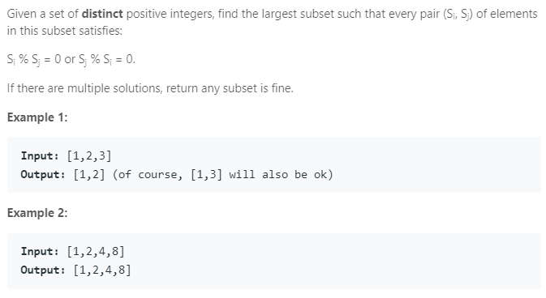

### Question



### My solution
```python
class Solution(object):
    def largestDivisibleSubset(self, nums):
        """
        :type nums: List[int]
        :rtype: List[int]
        """
        N = len(nums)
        sorted_nums = sorted(nums)

        opt = [[sorted_nums[i]] for i in range(N)]

        for i in range(N):
        	max_len, max_len_index = 1, -1
        	for j in range(i - 1, -1, -1):
        		if sorted_nums[i] % sorted_nums[j] == 0:
        			if len(opt[j]) + 1 > max_len:
        				max_len = len(opt[j]) + 1
        				max_len_index = j
        	if max_len_index != -1:
        		opt[i] = list(opt[max_len_index])
        		opt[i].append(sorted_nums[i])
                
        max_ls, max_ls_len = [], 0
        for ls in opt:
        	if len(ls) > max_ls_len:
        		max_ls = ls
        		max_ls_len = len(ls)

        return max_ls
```