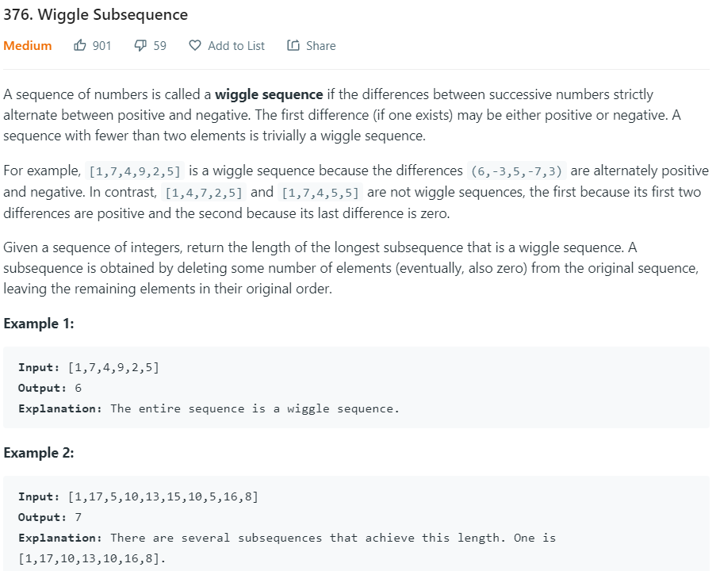

### Question



### My solution
Greedt solution ```O(n)```.
```python
class Solution(object):
    def wiggleMaxLength(self, nums):
        """
        :type nums: List[int]
        :rtype: int
        """
        if len(nums) < 2:
            return len(nums)
        
        wlen, start = 1, 1
        diff_prev = 0
        
        while start < len(nums) and diff_prev == 0: 
            diff_prev = nums[start] - nums[start-1]
            start += 1
        
        if diff_prev != 0:
            for i in range(start, len(nums)):
                diff = nums[i] - nums[i-1] 
                if diff * diff_prev < 0: 
                    wlen += 1
                    diff_prev = diff
            return wlen + 1
        return wlen
```
