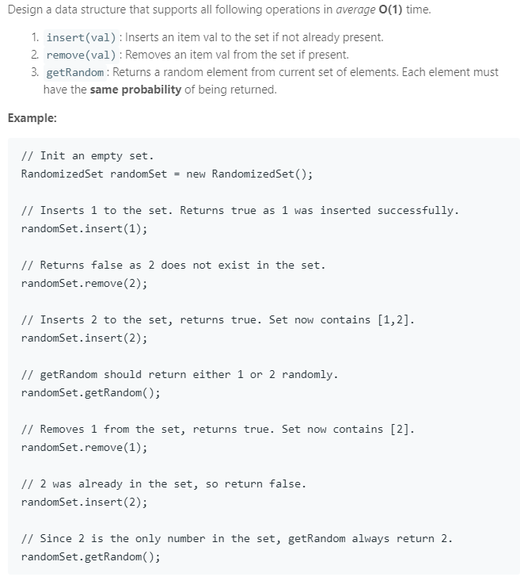

### Question



### My solution

```python
class RandomizedSet(object):

    def __init__(self):
        """
        Initialize your data structure here.
        """
        self.N = 0
        self.dict = {}
        self.ls = []

    def insert(self, val):
        """
        Inserts a value to the set. Returns true if the set did not already contain the specified element.
        :type val: int
        :rtype: bool
        """
        if val in self.dict:
            return False
        else:
            self.dict[val] = self.N
            self.ls.append(val)
            self.N += 1
            return True

    def remove(self, val):
        """
        Removes a value from the set. Returns true if the set contained the specified element.
        :type val: int
        :rtype: bool
        """
        if val in self.dict:
            idx = self.dict[val]
            val_last = self.ls[self.N - 1]
            self.dict[val], self.dict[val_last] = self.dict[val_last], self.dict[val]
            self.ls[idx], self.ls[self.N - 1] = self.ls[self.N - 1], self.ls[idx]
            self.dict.pop(val, None)
            self.ls.pop()
            self.N -= 1
            return True
        else:
            return False

    def getRandom(self):
        """
        Get a random element from the set.
        :rtype: int
        """
        return self.ls[random.randint(0, self.N - 1)]
        

# Your RandomizedSet object will be instantiated and called as such:
# obj = RandomizedSet()
# param_1 = obj.insert(val)
# param_2 = obj.remove(val)
# param_3 = obj.getRandom()

```