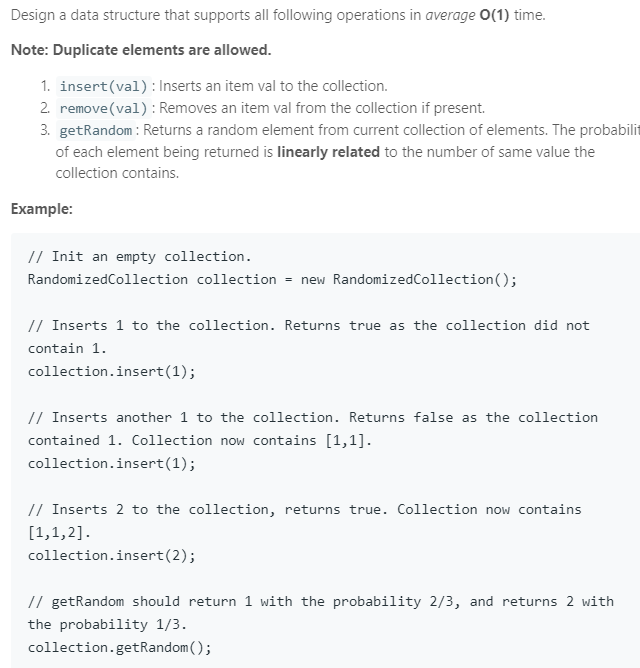

### Question



### My solution

```python
import random

class RandomizedCollection(object):

    def __init__(self):
        """
        Initialize your data structure here.
        """
        self.ls = []
        self.dict = {}

    def insert(self, val):
        """
        Inserts a value to the collection. Returns true if the collection did not already contain the specified element.
        :type val: int
        :rtype: bool
        """
        N = len(self.ls)
        self.ls.append(val)
        
        if val in self.dict:
            self.dict[val].add(N)
            return False
        else:
            self.dict[val] = set([N])
            return True
        

    def remove(self, val):
        """
        Removes a value from the collection. Returns true if the collection contained the specified element.
        :type val: int
        :rtype: bool
        """
        if val in self.dict:
            val, val_last = val, self.ls[-1]
            idx, idx_last = self.dict[val].pop(), len(self.ls) - 1
            
            if idx != idx_last:
                self.dict[val_last].remove(idx_last)
                self.dict[val_last].add(idx)
            
            self.ls[idx], self.ls[idx_last] = self.ls[idx_last], self.ls[idx]
            self.ls.pop()
            
            if len(self.dict[val]) == 0:
                self.dict.pop(val, None)
            
            return True
        else:
            return False

    def getRandom(self):
        """
        Get a random element from the collection.
        :rtype: int
        """
        return self.ls[random.randint(0, len(self.ls) - 1)]
        


# Your RandomizedCollection object will be instantiated and called as such:
# obj = RandomizedCollection()
# param_1 = obj.insert(val)
# param_2 = obj.remove(val)
# param_3 = obj.getRandom()

```