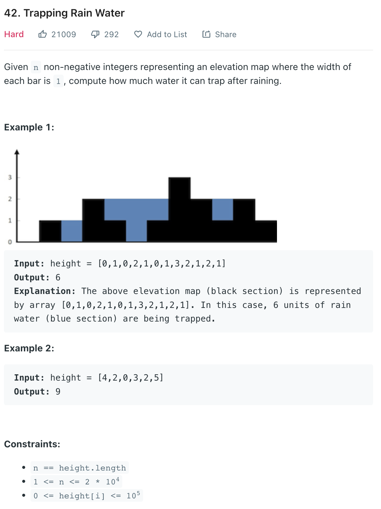

### Question



### My solution
O(n) memory and O(n) runtime
```python
class Solution:
    def trap(self, height: List[int]) -> int:
        si = -1
        for i, h in enumerate(height):
            if h > 0:
                si = i
                break
                
        if si == -1:
            return 0
        
        max_from_right = [0 for _ in height]
        max_from_right[-1] = height[-1]
        
        i = len(height) - 1
        for h in reversed(height):
            if i < len(height) - 1:
                max_from_right[i] = max(max_from_right[i+1], h)
            i = i - 1
        
        st = []
        w = 0
        left = height[si]
        if si+1 < len(height) and max_from_right[si+1] < left:
            left = max_from_right[si+1]
        
        for i, h in enumerate(height):
            if i > si:
                if h >= left:
                    while len(st) > 0:
                        w += left - st.pop()
                    left = h
                    if i+1 < len(height) and max_from_right[i+1] < left:
                        left = max_from_right[i+1]
                else:
                    st.append(h)
            # print(i, left, st, h, w)
        
        return w
```

### Better solutions
single pass using a stack, O(n) runtime and O(n) memory
```python
class Solution:
    def trap(self, height: List[int]) -> int:
        stack = []
        water = 0
        for i, e in enumerate(height):
            # we need to see if we can form a container
            while stack and e >= stack[-1][0]:
                popped, _ = stack.pop()
                # is it a container though? we have a left border?
                if stack:
                    left_border, j = stack[-1]
                    # print("left border = {}, popped = {}".format(left_border, popped))
                    # we compute the water
                    water += min(left_border-popped, e-popped)*(i-j-1)
            stack.append((e,i))
        return water
```

single pass using 2 pointers approach, O(n) runtime and O(1) memory
```python
class Solution:
    def trap(self, bars):
        if not bars or len(bars) < 3:
            return 0
        volume = 0
        left, right = 0, len(bars) - 1
        l_max, r_max = bars[left], bars[right]
        while left < right:
            l_max, r_max = max(bars[left], l_max), max(bars[right], r_max)
            if l_max <= r_max:
                volume += l_max - bars[left]
                left += 1
            else:
                volume += r_max - bars[right]
                right -= 1
        return volume
```
