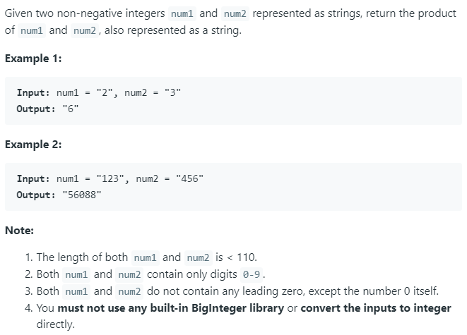

### Question



### My solution
```python
def str2int(string):
    if string == "0":
        return 0
    if string == "1":
        return 1
    if string == "2":
        return 2
    if string == "3":
        return 3
    if string == "4":
        return 4
    if string == "5":
        return 5
    if string == "6":
        return 6
    if string == "7":
        return 7
    if string == "8":
        return 8
    if string == "9":
        return 9

def multiply_single_digit(num_str, digit):    
    N = len(num_str)
    carry_over = 0
    product_str = ''
    
    for i in range(1, N + 1):
        digit_str = num_str[-i]
        product = str2int(digit_str) * digit + carry_over
        product_str = str(product % 10) + product_str
        carry_over = int(product / 10)
    
    product_str = str(carry_over) + product_str
    return int(product_str)

def pow_of_ten(n):
    if n == 0:
        return 1
    else:
        result = 1
        for i in range(n):
            result = (result << 3) + (result << 1)
        return result

class Solution(object):
    def multiply(self, num1, num2):
        """
        :type num1: str
        :type num2: str
        :rtype: str
        """
        if len(num2) > len(num1):
            num1, num2 = num2, num1
        
        product = 0
        for i in range(1, len(num2) + 1):
            product += (multiply_single_digit(num1, str2int(num2[-i])) * pow_of_ten(i-1))

        return str(product)
        
        
        
```