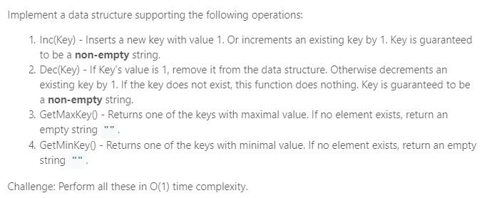

### Question



### My solution
Basic idea: Doubly Linked List + Hash Table
```python
class Node(object):
    def __init__(self, val):
        self.val = val
        self.set = set()
        self.left = None
        self.right = None
        
    def size(self):
        return len(self.set)
    
    def getAnyKey(self):
        key = self.set.pop()
        self.set.add(key)
        return key
    
    def removeKey(self, key):
        assert(key in self.set), "key not in set!"
        self.set.remove(key)
        
    def addKey(self, key):
        self.set.add(key)
    
    def appendLeft(self, node):
        assert(node is not None), "new node cannot be None!"
        
        oldLeft = self.left

        # edit self
        self.left = node

        # edit new node
        node.right = self
        node.left = oldLeft

        # edit old left
        if oldLeft:
            oldLeft.right = node
            
    def appendRight(self, node):
        assert(node is not None), "new node cannot be None!"
        
        oldRight = self.right
        
        # edit self
        self.right = node

        # edit new node
        node.left = self
        node.right = oldRight

        # edit old left
        if oldRight:
            oldRight.left = node
            
    def delete(self):
        left, right = self.left, self.right
        
        if left:
            left.right = right
            
        if right:
            right.left = left

class AllOne(object):

    def __init__(self):
        """
        Initialize your data structure here.
        """
        # key to node dictionary
        self.key_to_node = {}
        
        # leftmost and rightmost nodes in a doubly linked list
        self.left_end = None
        self.right_end = None
        
    def inc(self, key):
        """
        Inserts a new key <Key> with value 1. Or increments an existing key by 1.
        :type key: str
        :rtype: void
        """
        if key in self.key_to_node:
            node = self.key_to_node[key] 
            val = node.val
            
            if node.left and node.left.val == val + 1:
                # next node exists
                node.removeKey(key)
                node.left.addKey(key)
                self.key_to_node[key] = node.left
            
            else:
                # next node does not exist
                node.removeKey(key)
                new_node = Node(val + 1)
                new_node.addKey(key)
                node.appendLeft(new_node)
                self.key_to_node[key] = new_node
                
                # update left end if required
                if not new_node.left:
                    self.left_end = new_node
            
            # delete node if it has become empty
            if node.size() == 0:
                if not node.right:
                    self.right_end = node.left

                if not node.left:
                    self.left_end = node.right

                node.delete()
    
        else:
            if not self.right_end:
                new_node = Node(1)
                new_node.addKey(key)
                self.key_to_node[key] = new_node
                self.left_end = new_node
                self.right_end = new_node
                
            elif self.right_end.val == 1:
                self.right_end.addKey(key)
                self.key_to_node[key] = self.right_end
            
            else:
                new_node = Node(1)
                new_node.addKey(key)
                self.key_to_node[key] = new_node
                self.right_end.appendRight(new_node)
                self.right_end = new_node

    def dec(self, key):
        """
        Decrements an existing key by 1. If Key's value is 1, remove it from the data structure.
        :type key: str
        :rtype: void
        """ 
        if key in self.key_to_node:
            node = self.key_to_node[key] 
            val = node.val
            
            if val == 1:
                # need to remove this key
                node.removeKey(key)
                self.key_to_node.pop(key, None)
            
            elif node.right and node.right.val == val - 1:
                # next node exists
                node.removeKey(key)
                node.right.addKey(key)
                self.key_to_node[key] = node.right
            
            else:
                # next node does not exist
                node.removeKey(key)
                new_node = Node(val - 1)
                new_node.addKey(key)
                node.appendRight(new_node)
                self.key_to_node[key] = new_node
                
                # update left end if required
                if not new_node.right:
                    self.right_end = new_node
            
            # delete node if it has become empty
            if node.size() == 0:
                if not node.right:
                    self.right_end = node.left

                if not node.left:
                    self.left_end = node.right

                node.delete()

    def getMaxKey(self):
        """
        Returns one of the keys with maximal value.
        :rtype: str
        """
        if self.left_end:
            return self.left_end.getAnyKey()
        else:
            return ""

    def getMinKey(self):
        """
        Returns one of the keys with Minimal value.
        :rtype: str
        """
        if self.right_end:
            return self.right_end.getAnyKey()
        else:
            return ""

# Your AllOne object will be instantiated and called as such:
# obj = AllOne()
# obj.inc(key)
# obj.dec(key)
# param_3 = obj.getMaxKey()
# param_4 = obj.getMinKey()
```
