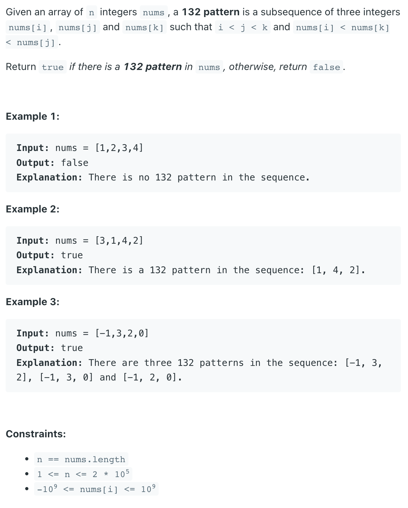

### Question



### My solution
```python
class Solution:
    def find132pattern(self, nums: List[int]) -> bool:
        if len(set(nums)) <= 2:
            return False
        
        min_from_left = [n for n in nums]
        for i, num in enumerate(nums):
            if i > 0:
                min_from_left[i] = min(min_from_left[i-1], num)
            
        st = []
        
        for i in range(len(nums)-1, -1, -1):
            if nums[i] > min_from_left[i]:
                while st and st[-1] <= min_from_left[i]:
                    st.pop()
                
                if st and min_from_left[i] < st[-1] and st[-1] < nums[i]:
                    return True
                
                st.append(nums[i])
                
        return False
```
