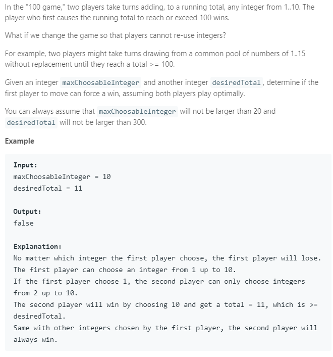

### Question



### My solution
```python
class Solution(object):
    def minimax(self, available_integers, currentSum, maximizingPlayer, alpha, beta):
        tup_available_integers = tuple(available_integers)
        
        if currentSum >= self.desiredTotal:
            if maximizingPlayer:
                # means that maximizingPlayer has just lost!
                return -1
            else:
                # maximizingPlayer won last turn!
                return 1
        
        elif tup_available_integers in self.seen:
            return self.seen[tup_available_integers]
        
        elif maximizingPlayer:
            maxEval = -1 
            for i, integer in enumerate(available_integers):
                eval = self.minimax(available_integers[:i] + available_integers[i+1:], currentSum + integer, False, alpha, beta)
                maxEval = max(maxEval, eval)
                alpha = max(alpha, eval)
                
                # prune condition(s)
                if beta <= alpha:
                    break
                if maxEval == 1:
                    break
            
            # memorize this outcome
            self.seen[tup_available_integers] = maxEval
            return maxEval
            
        else:
            minEval = 1
            for i, integer in enumerate(available_integers):
                eval = self.minimax(available_integers[:i] + available_integers[i+1:], currentSum + integer, True, alpha, beta)
                minEval = min(minEval, eval)
                beta = min(beta, eval)
                
                # prune condition(s)
                if beta <= alpha:
                    break
                if minEval == -1:
                    break
            
            # memorize this outcome
            self.seen[tup_available_integers] = minEval
            return minEval
    
    def canIWin(self, maxChoosableInteger, desiredTotal):
        """
        :type maxChoosableInteger: int
        :type desiredTotal: int
        :rtype: bool
        """
        self.desiredTotal = desiredTotal
        
        # dictionary for memorizing results
        self.seen = {}
        
        # check special case
        S = maxChoosableInteger * (maxChoosableInteger + 1) // 2
        
        if S < desiredTotal:
            return False
        elif desiredTotal <= 0 or maxChoosableInteger >= desiredTotal:
            return True
        else:
            available_integers = ([(i+1) for i in range(maxChoosableInteger)])
            evaluation = self.minimax(available_integers, 0, True, -1, 1)
            
            if evaluation == 1:
                return True
            else:
                return False
```