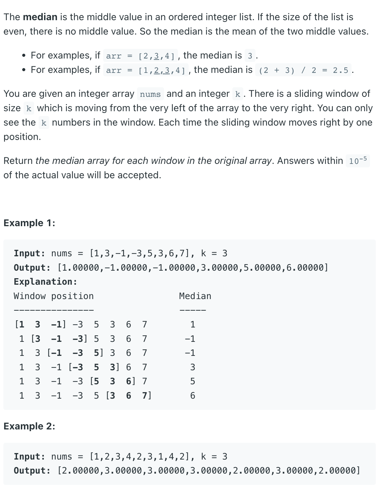

### Question



### My solution
Customized Heap + Queue
```python
from collections import deque

class Node:
    def __init__(self, value):
        self.value = value
        self.idx = None
        self.heap_type = None
        
    def update_idx(self, i):
        self.idx = i
        
    def __str__(self):
        return 'Node(value={},idx={})'.format(self.value, self.idx)
        

class MyHeap:
    def __init__(self, key=lambda r: r):
        self.data = []
        self.key = key
    
    def push(self, item):
        item.update_idx(len(self.data))
        self.data.append(item)
        i = self.sift_up(len(self.data)-1)
        i = self.sift_down(i)
        return i
    
    def delete_at(self, i):
        n = self.data[i]
        if i == 0 and len(self.data) == 1:
            self.data[0].update_idx(None)
            self.data = []
        elif i == len(self.data)-1:
            n = self.data.pop()
            n.update_idx(None)
        else:
            self.data[i].update_idx(None)
            self.data[i] = self.data[-1]
            self.data[i].update_idx(i)
            self.data.pop()
            i = self.sift_down(i)
            i = self.sift_up(i)
        return n
        
    def sift_up(self, i):
        parent = int((i-1)*0.5)
        # print(parent, i, len(self.data))
        if parent >= 0 and parent != i and self.key(self.data[parent]) > self.key(self.data[i]):
            tmp = self.data[parent]
            self.data[parent] = self.data[i]
            self.data[parent].update_idx(parent)
            self.data[i] = tmp
            self.data[i].update_idx(i)
            return self.sift_up(parent)
        
        return i
    
    def sift_down(self, i):
        left = 2*i+1
        right = 2*i+2
        if left >= len(self.data):
            return i
        
        mc = left
        if right < len(self.data) and self.key(self.data[right]) < self.key(self.data[left]):
            mc = right
            
        if self.key(self.data[i]) > self.key(self.data[mc]):
            tmp = self.data[i]
            self.data[i] = self.data[mc]
            self.data[i].update_idx(i)
            self.data[mc] = tmp
            self.data[mc].update_idx(mc)
            return self.sift_down(mc)
        
        return i
    
    def __str__(self):
        return str([str(n) for n in self.data])
        
        

class Solution:
    def medianSlidingWindow(self, nums: List[int], k: int) -> List[float]:
        if k == 1:
            return [float(n) for n in nums]
        
        queue = deque([Node(nums[i]) for i in range(k)])
        
        # populate empty min and max heap
        max_heap = MyHeap(key=lambda r: -1*r.value)
        for n in queue:
            max_heap.push(n)
            n.heap_type = 0
        
        min_heap = MyHeap(key=lambda r: r.value)
        while len(max_heap.data) > int(0.5*k):
            n = max_heap.delete_at(0)
            min_heap.push(n)
            n.heap_type = 1
            
        def get_median(max_heap, min_heap):
            if len(max_heap.data) == len(min_heap.data):
                return 0.5*(max_heap.data[0].value+min_heap.data[0].value)
            elif len(max_heap.data) > len(min_heap.data):
                return max_heap.data[0].value
            return min_heap.data[0].value
        
        result = []
        for i in range(k, len(nums), 1):
            # print('deque:', [str(n) for n in queue])
            # print('max:', max_heap)
            # print('min:', min_heap)
            
            # get median
            result.append(get_median(max_heap, min_heap))
            
            # print('median:', get_median(max_heap, min_heap))
            
            # delete old element
            old_node = queue.popleft()
            if old_node.heap_type == 0:
                max_heap.delete_at(old_node.idx)
            elif old_node.heap_type == 1:
                min_heap.delete_at(old_node.idx)
            
            # add new element
            new_node = Node(nums[i])
            queue.append(new_node)
            
            if len(max_heap.data) > 0 and new_node.value <= max_heap.data[0].value:
                max_heap.push(new_node)
                new_node.heap_type = 0
            else:
                min_heap.push(new_node)
                new_node.heap_type = 1
                
            # rebalance if needed
            while len(min_heap.data) - len(max_heap.data) > 1:
                n = min_heap.delete_at(0)
                max_heap.push(n)
                n.heap_type = 0
                
            while len(max_heap.data) - len(min_heap.data) > 0:
                n = max_heap.delete_at(0)
                min_heap.push(n)
                n.heap_type = 1
            
        result.append(get_median(max_heap, min_heap))
        return result
```

### Cleaner Solution (using sortedlist)
```python
from sortedcontainers import SortedList


class Solution:
    def medianSlidingWindow(self, nums: List[int], k: int) -> List[float]:
        if k == 1:
            return [float(n) for n in nums]
        
        def get_median(ls):
            if len(ls) % 2 == 1:
                return ls[int(len(ls)*0.5)]
            return 0.5*(ls[int(len(ls)*0.5)]+ls[int(len(ls)*0.5)-1])
        
        ls = SortedList()
        result = []
        
        for i, num in enumerate(nums):
            ls.add(num)
            if len(ls) == k:
                result.append(get_median(ls))
                ls.discard(nums[i-k+1])
        
        return result
```
