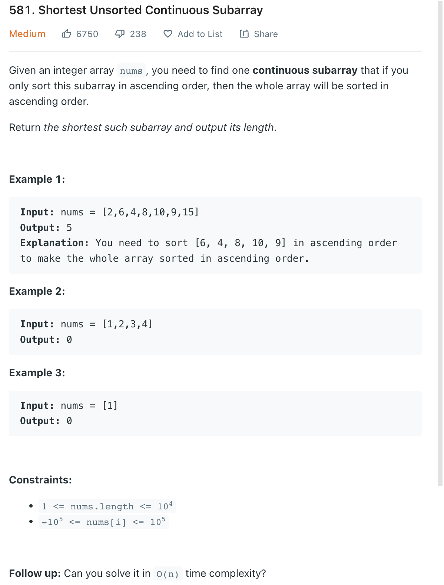

### Question



### My solution
```python
class Solution:
    def findUnsortedSubarray(self, nums: List[int]) -> int:
        if len(nums) <= 1:
            return 0
        
        n = len(nums)
        left = 0
        right = n-1
        
        while left < n-1 and nums[left] <= nums[left+1]:
            left += 1
            
        if left == n-1:
            return 0
        
        while right > 0 and nums[right] >= nums[right-1]:
            right -= 1
        
        i = left
        window_min, window_max = nums[left], nums[left] 
        while i <= right:
            window_min = min(window_min, nums[i])
            window_max = max(window_max, nums[i])
            i += 1
            
        i = left-1
        while i >= 0 and nums[i] > window_min:
            left -= 1 
            i -= 1
            
        i = right+1
        while i < n and nums[i] < window_max:
            right += 1
            i += 1
            
        return right-left+1
```
