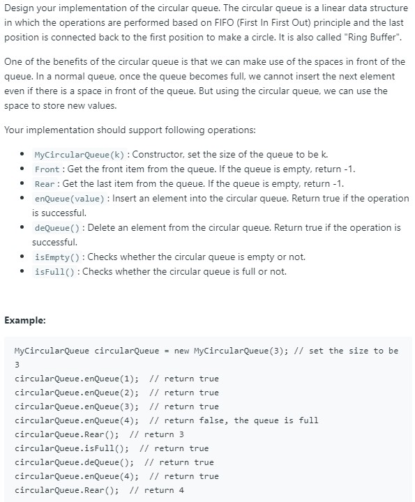

### Question



### My solution
```python
class Node(object):
    def __init__(self, value):
        self.value = value
        self.next = None

class MyCircularQueue(object):

    def __init__(self, k):
        """
        Initialize your data structure here. Set the size of the queue to be k.
        :type k: int
        """
        self.head = None
        self.tail = None
        self.N, self.k = 0, k

    def enQueue(self, value):
        """
        Insert an element into the circular queue. Return true if the operation is successful.
        :type value: int
        :rtype: bool
        """
        if self.isFull():
            return False
        
        elif self.isEmpty():
            self.head = Node(value)
            self.tail = self.head
            self.N += 1
            return True
            
        else:
            node = Node(value)
            self.tail.next = node
            self.tail = self.tail.next
            self.N += 1
            return True

    def deQueue(self):
        """
        Delete an element from the circular queue. Return true if the operation is successful.
        :rtype: bool
        """
        if self.isEmpty():
            return False
        
        elif self.N == 1:
            self.head = None
            self.tail = None
            self.N -= 1
            return True
            
        else: 
            self.head = self.head.next
            self.N -= 1
            return True

    def Front(self):
        """
        Get the front item from the queue.
        :rtype: int
        """
        if self.isEmpty():
            return -1
        else:
            return self.head.value

    def Rear(self):
        """
        Get the last item from the queue.
        :rtype: int
        """
        if self.isEmpty():
            return -1
        else:
            return self.tail.value

    def isEmpty(self):
        """
        Checks whether the circular queue is empty or not.
        :rtype: bool
        """
        return self.N == 0

    def isFull(self):
        """
        Checks whether the circular queue is full or not.
        :rtype: bool
        """
        return self.N == self.k
```