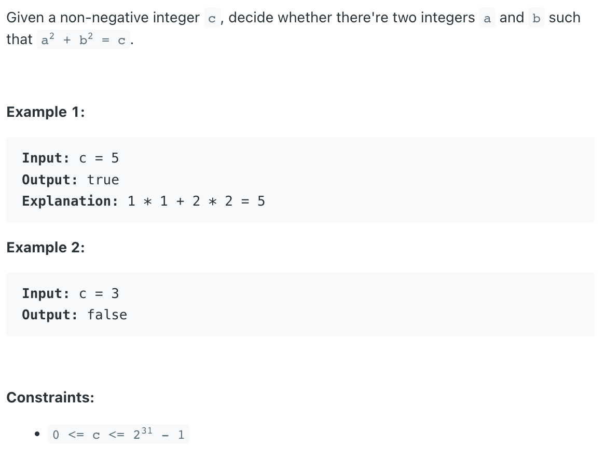

### Question



### My solution
```python
import math 


class Solution:
    def judgeSquareSum(self, c: int) -> bool:
        if c <= 2:
            return True
        
        # check if c = 2*x*x
        if c % 2 == 0:
            c_half = int(c / 2)
            c_half_sqrt = math.sqrt(c_half)
            if c_half_sqrt - int(c_half_sqrt) < 1e-10:
                return True
        
        # check if c = x*x + 0*0
        c_sqrt = math.sqrt(c)
        upper_bound = int(math.ceil(c_sqrt))
        if upper_bound - c_sqrt < 1e-10:
            return True
        
        # general case
        left = 1
        right = upper_bound
        while left < right:
            result = left*left + right*right
            if result == c:
                return True
            elif result > c:
                right -= 1
            else:
                left += 1
        
        return False
```
