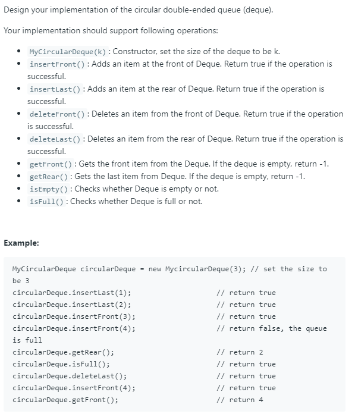

### Question



### My solution
```python

class Node(object):
    
    def __init__(self, value):
        self.value = value
        self.left = None
        self.right = None

class MyCircularDeque(object):

    def __init__(self, k):
        """
        Initialize your data structure here. Set the size of the deque to be k.
        :type k: int
        """
        self.head, self.tail = None, None
        self.N, self.k = 0, k

    def insertFront(self, value):
        """
        Adds an item at the front of Deque. Return true if the operation is successful.
        :type value: int
        :rtype: bool
        """
        if self.isFull():
            return False
        
        elif self.isEmpty():
            self.head = Node(value)
            self.tail = self.head
            self.N += 1
            return True
            
        else:
            node = Node(value)
            self.head.left = node
            node.right = self.head
            self.head = node
            self.N += 1
            return True
            
    def insertLast(self, value):
        """
        Adds an item at the rear of Deque. Return true if the operation is successful.
        :type value: int
        :rtype: bool
        """
        if self.isFull():
            return False
        
        elif self.isEmpty():
            return self.insertFront(value)
        
        else:
            node = Node(value)
            self.tail.right = node
            node.left = self.tail
            self.tail = node
            self.N += 1
            return True

    def deleteFront(self):
        """
        Deletes an item from the front of Deque. Return true if the operation is successful.
        :rtype: bool
        """
        if self.isEmpty():
            return False
        
        elif self.N == 1:
            self.head, self.tail = None, None
            self.N -= 1
            return True
            
        else:
            self.head = self.head.right
            self.head.left = None
            self.N -= 1
            return True

    def deleteLast(self):
        """
        Deletes an item from the rear of Deque. Return true if the operation is successful.
        :rtype: bool
        """
        if self.isEmpty():
            return False
        
        elif self.N == 1:
            return self.deleteFront()
        
        else:
            self.tail = self.tail.left
            self.tail.right = None
            self.N -= 1
            return True

    def getFront(self):
        """
        Get the front item from the deque.
        :rtype: int
        """
        if self.isEmpty():
            return -1
        else:
            return self.head.value

    def getRear(self):
        """
        Get the last item from the deque.
        :rtype: int
        """
        if self.isEmpty():
            return -1
        else:
            return self.tail.value

    def isEmpty(self):
        """
        Checks whether the circular deque is empty or not.
        :rtype: bool
        """
        return self.N == 0

    def isFull(self):
        """
        Checks whether the circular deque is full or not.
        :rtype: bool
        """
        return self.N == self.k
```
