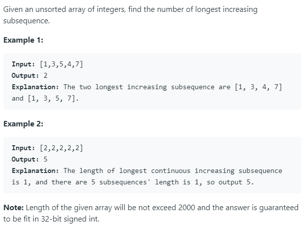

### Question



### My solution
```python
class Solution(object):
    def findNumberOfLIS(self, nums):
        """
        :type nums: List[int]
        :rtype: int
        """
        N = len(nums)
        
        # edge cases
        if N <= 1:
            return N
        
        # L[i] is the length of LIS from nums[0] to nums[i], ending at nums[i] 
        # L[j] = max(L[i] + 1) for all i < j and nums[i] < nums[j]
        L = [1 for i in range(N)]
        
        # initialize list for counting number of LIS ending at i-th index
        counts = [1 for i in range(N)]
        
        # DP loop
        for i in range(1, N):
            for j in range(i):
                if nums[i] > nums[j]:
                    if L[i] <= L[j]:
                        # this is intuitive
                        L[i] = L[j] + 1
                        # important line, think about why it is = and not += 
                        counts[i] = counts[j]
                    
                    elif L[j] + 1 == L[i]:
                        counts[i] += counts[j]
                        
        longest_len = max(L)
        return sum(c for i, c in enumerate(counts) if L[i] == longest_len)
```