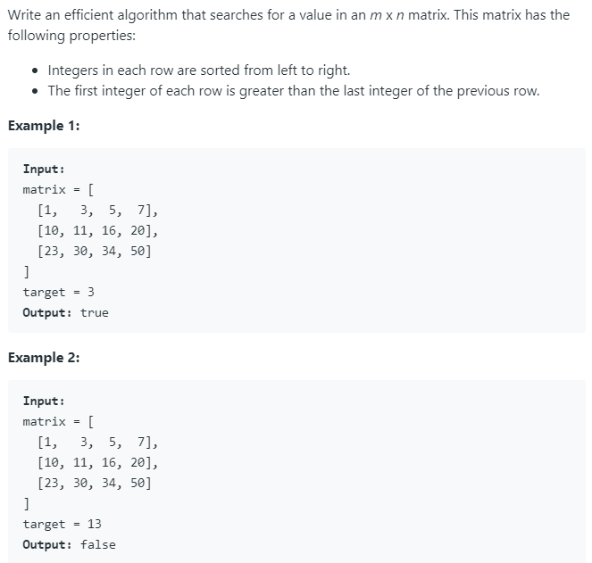

### Question



### My solution
```python
class Solution(object):
    def binarySearch_list(self, val, ls, s, e):
        if len(ls) == 1:
            return ls[0] == val
        if s == e:
            return ls[e] == val
        if e == s + 1:
            return (ls[e] == val) or (ls[s] == val)
        if ls[s] > val or ls[e] < val:
            return False
        
        mid = int((s + e) * 0.5)
        if ls[mid] == val:
            return True
        elif ls[mid] > val:
            return self.binarySearch_list(val, ls, s, mid - 1)
        else:
            return self.binarySearch_list(val, ls, mid + 1, e)      
    
    def binarySearch_matrix(self, val, matrix, s, e):
        if len(matrix) == 1:
            return self.binarySearch_list(val, matrix[0], 0, len(matrix[0]) - 1)
        elif s == e:
            return self.binarySearch_list(val, matrix[s], 0, len(matrix[s]) - 1)
        elif e == s + 1:
            return self.binarySearch_list(val, matrix[s], 0, len(matrix[s]) - 1) or self.binarySearch_list(val, matrix[e], 0, len(matrix[e]) - 1)
        elif matrix[s][0] > val or matrix[e][-1] < val:
            return False
        else:
            mid = int((s + e) * 0.5)
            if matrix[mid][0] == val or matrix[mid][-1] == val:
                return True
            elif matrix[mid][0] < val and matrix[mid][-1] > val:
                return self.binarySearch_list(val, matrix[mid], 0, len(matrix[mid]) - 1)
            elif matrix[mid][0] > val:
                return self.binarySearch_matrix(val, matrix, s, mid - 1)
            else:
                return self.binarySearch_matrix(val, matrix, mid + 1, e) 
    
    def searchMatrix(self, matrix, target):
        """
        :type matrix: List[List[int]]
        :type target: int
        :rtype: bool
        """
        if len(matrix) == 0:
            return False
        if len(matrix[0]) == 0:
            return False
        return self.binarySearch_matrix(target, matrix, 0, len(matrix) - 1)
        
```