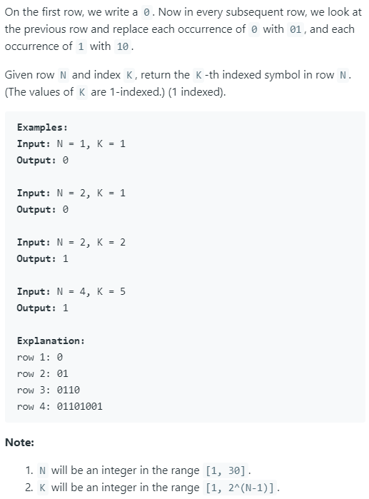

### Question



### My solution
```python
import math

class Solution(object):
    def kthGrammar(self, N, K):
        """
        :type N: int
        :type K: int
        :rtype: int
        """
        if K == 1:
            return 0
        else:
            parent = self.kthGrammar(N / 2, math.ceil(K * 0.5))
            if (parent == 0 and K % 2 == 1) or (parent == 1 and K % 2 == 0):
                return 0
            else:
                return 1
```