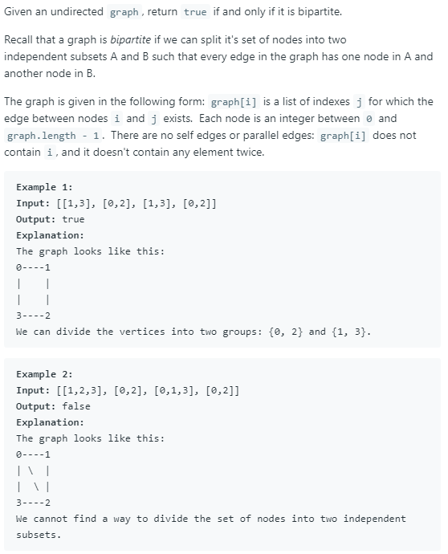

### Question



### My solution
Idea: BFS/DFS + Coloring
```python
from collections import deque

class Solution(object):
    def isBipartite(self, graph):
        """
        :type graph: List[List[int]]
        :rtype: bool
        """
        # idea: 
        # 1. perform DFS (on each connected components)
        # 2. while traversing the graph, color each node with either BLACK or WHITE
        # 3. if we find that two adjacent nodes have same color, this means that the graph is not bipartite
        
        # --------------------------- Early Exit --------------------------- #
        # edge case
        if len(graph) == 1:
            return True
        
        # --------------------------- Setup --------------------------- #
        # keep a reference of the graph in this object
        self.graph = graph
        
        # boolean flag for early exit
        self.bad_coloring_found = False
        
        # array to keep track which nodes have been traversed
        self.traversed_ls = [False for i in range(len(graph))]
        
        # array to keep track of the color of each node (None = haven't assign, 1 = BLACK, 0 = WHITE)
        self.color = [None for i in range(len(graph))]
        
        # --------------------------- Algo --------------------------- #
        # iterate through every node, perform dfs on every connected components
        for node, adjacent_ls in enumerate(graph):
            if not self.traversed_ls[node]:
                self.dfs(node, adjacent_ls, 1)
                # self.bfs(node)
                
            if self.bad_coloring_found:
                return False
            
        return not self.bad_coloring_found
    
    def dfs(self, node, adjacent_ls, color):        
        adjacent_ls = self.graph[node]
        self.traversed_ls[node] = True
        self.color[node] = color
        
        for _node in adjacent_ls:
            if (self.color[_node] is not None) and self.color[_node] == color:
                self.bad_coloring_found = True
                return
            
            if not self.traversed_ls[_node] and not self.bad_coloring_found:
                self.dfs(_node, self.graph[_node], 1 - color)
    
    def bfs(self, root):
        queue = deque([(root, 1)])
        
        while len(queue) > 0:
            # pop from queue
            node, current_color = queue.pop()
            
            # early exit
            if self.traversed_ls[node]:
                continue
            else:
                self.traversed_ls[node] = True
            
            adjacent_ls = self.graph[node]
            self.color[node] = current_color
                        
            for _node in adjacent_ls:
                if self.traversed_ls[_node]:
                    if self.color[_node] == current_color:
                        self.bad_coloring_found = True
                        return
                    else:
                        continue
                else:
                    queue.appendleft((_node, 1 - current_color))
```