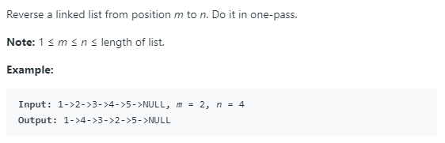

### Question



### My solution
```python
# Definition for singly-linked list.
# class ListNode:
#     def __init__(self, x):
#         self.val = x
#         self.next = None

class Solution:
    def reverseBetween(self, head: ListNode, m: int, n: int) -> ListNode:
        # idea:
        # 1. first, do .next (m - 1) times to get the first node 
        # 2. reverse the direciton of pointers (n - m) times
        # 3. reattach to nodes that were not reversed (if any)
        
        # edge cases
        if head is None:
            return head
        if m == n:
            return head
        if head.next is None:
            return head
        
        pre = None
        curr_node = head
        
        if m == 1:
            pass
        
        if m >= 2:
            pre = curr_node
            curr_node = curr_node.next        
                
            for i in range(m - 2):
                pre = pre.next
                curr_node = curr_node.next
                            
        # reverse direction of pointers (n - m) times
        _pre, _post = curr_node, curr_node.next
        
        for i in range(n - m):
            _pre, _post = self._reverse(_pre, _post)
                
        if pre is not None:
            pre.next = _pre
        
        curr_node.next = _post 
        
        if pre is None:
            return _pre
        else:
            return head
            
    def _reverse(self, pre, node):
        next_node = node.next
        node.next = pre
        return node, next_node
```