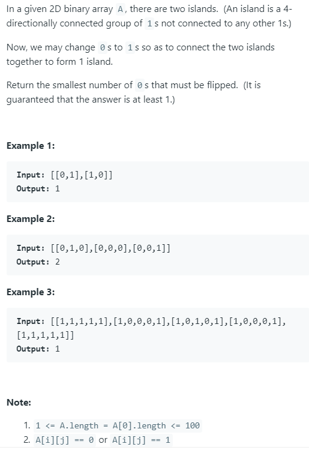

### Question



### My solution
```python
from collections import deque

class Solution(object):
    def __init__(self):
        self.island = set()
        self.visited = set()
        self.queue = deque([])
        self.min_dist = None
    
    def point(self, i, j):
        return (i, j)
    
    def populate_island(self, i, j):
        if i >= self.N or j >= self.N or i < 0 or j < 0:
            return
        elif self.point(i, j) in self.island:
            return
        elif self.A[i][j] == 1:
            self.island.add(self.point(i, j))
            self.populate_island(i, j - 1)
            self.populate_island(i, j + 1)
            self.populate_island(i - 1, j)
            self.populate_island(i + 1, j)
            return
        else:
            self.queue.appendleft((self.point(i, j), 1))
            self.visited.add(self.point(i, j))
            return
    
    def explore(self, i, j, dist):
        if i >= self.N or j >= self.N or i < 0 or j < 0:
            return
        elif (self.point(i, j) in self.visited) or (self.point(i, j) in self.island):
            return
        elif self.A[i][j] == 0:
            self.queue.appendleft((self.point(i, j), dist + 1))
            self.visited.add(self.point(i, j))
            return
        elif self.A[i][j] == 1:
            self.min_dist = dist
            return
    
    def shortestBridge(self, A):
        """
        :type A: List[List[int]]
        :rtype: int
        """
        self.A = A
        self.N = len(A)
        N = self.N
        if N == 1:
            return 0
        
        found_island = False 
        for i in range(N):
            if found_island:
                break
            for j in range(N):
                if A[i][j] == 1:
                    self.populate_island(i, j)
                    found_island = True
                    break
                    
        Q = len(self.queue)
        while Q > 0:
            pt, dist = self.queue.pop()
            self.explore(pt[0] - 1, pt[1], dist)
            self.explore(pt[0] + 1, pt[1], dist)
            self.explore(pt[0], pt[1] - 1, dist)
            self.explore(pt[0], pt[1] + 1, dist)
            
            if self.min_dist is not None:
                return self.min_dist
            
            Q = len(self.queue)
```